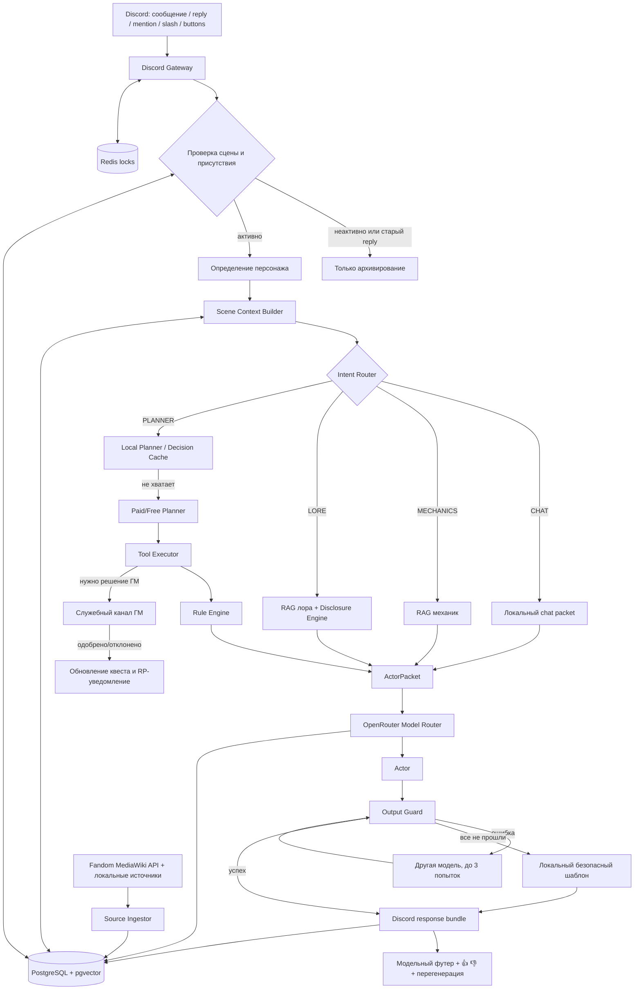

# Архитектура ИИ-NPC «Странник» для Discord-проекта «Фаервелл»

> **Статус документа:** актуальная архитектура реализации
> **Версия системы:** `0.8.0`
> **Дата фиксации:** 19 июля 2026
> **Назначение:** основной источник проекта для дальнейшей разработки, ревью и работы ИИ-ассистентов
> **Заменяет:** ранний архитектурный документ 1.6 и разрозненные release notes v0.4–v0.7.4

---

## 1. Решение в одном абзаце

«Странник» — единая постоянная RP-сущность Discord-сервера Фаервелла. Бот принимает сообщения игроков, определяет активного персонажа, собирает сцену, память, отношения, текущую локацию и подтверждённые знания мира, после чего выбирает один из четырёх маршрутов: обычный разговор, механики, лор или многошаговое действие. Простые решения выполняются локально, сложные могут передаваться модели-планировщику, а художественный RP-ответ всегда создаёт отдельная модель-актёр. Все сведения проходят RAG, правила раскрытия, серверные инструменты и финальную проверку. Рискованные квесты и изменения мира отправляются в служебный канал ГМ, не раскрывая игроку внутренний процесс. Присутствие Странника, персонажи, память, задания, отзывы, модельные вызовы и знания сохраняются в PostgreSQL; Redis используется для блокировок сцен.

---

## 2. Главные архитектурные принципы

### 2.1 Одна сущность, много социальных масок

Странник — одна метафизическая сущность с единым `traveler_entity_id=traveler_01`, общей памятью и устойчивым характером. Профессии (`traveler`, `merchant`, `guide`, `herbalist`, `artisan`) являются масками поведения, словаря и доступных шаблонов заданий, но не отдельными NPC.

### 2.2 Модель не является источником истины

Ни актёр, ни планировщик не имеют права самостоятельно создавать канон, цены, даты, правителей, войны, географию, предметы, награды или изменения мира. Источниками истины являются:

1. серверные данные и подтверждённое состояние БД;
2. индексированная официальная вики и проектные документы;
3. валидированные механики;
4. решение ГМ для рискованных последствий;
5. только после этого — модельная формулировка.

### 2.3 Слова игрока — утверждение персонажа, а не факт мира

Заявления «я бог», «я твой создатель», «я король», «я отрубил тебе руку» не становятся истиной автоматически. Они сохраняются как `PLAYER_SAID` / `UNVERIFIED`. В бою сообщение игрока описывает попытку; исход определяет система с учётом сцены, возможностей Странника и подтверждённых последствий.

### 2.4 Планирование и художественная речь разделены

Планировщик создаёт строгий `ActorPacket`, вызывает разрешённые инструменты и принимает структурное решение. Актёр получает только разрешённые факты и пишет RP-текст. Модель не получает SQL, токены, внутренние идентификаторы заявок или служебные пояснения.

### 2.5 Любое изменение мира проходит серверную проверку

Квест, награда, инвентарь, рыночная цена, прогресс или другое состояние не считаются действующими, пока серверная логика не проверила схему, ограничения и доказательства. Для рискованных случаев создаётся `GMReviewRequest`.

### 2.6 Дешёвые модели используются широко, платные — только в заданных ценовых рамках

Система получает живой каталог OpenRouter и допускает все бесплатные текстовые модели, кроме явного blacklist. Платные модели допускаются только при соблюдении лимитов на вход, выход и фиксированную цену запроса. Предпочтительный список задаёт порядок, но не является whitelist.

### 2.7 Канонический RAG не показывает служебные источники в RP

Поиск по вики сначала выделяет имя сущности из исходного запроса игрока. Общие слова вроде «королевство», «правитель», «расположение» и «дата» не используются как самостоятельные совпадения заголовка. Для прямого совпадения все оставшиеся смысловые основы должны присутствовать в названии статьи. Поэтому запрос об Ивелтине не может быть подменён другим государством только из-за слова «королевство».

Названия источников, ссылки, внутренние причины выбора модели и служебные идентификаторы сохраняются в `ResponseBundle`, `ModelCallLog` и журнале аудита, но не добавляются в публичный RP-пост. Игрок видит только художественный ответ и разрешённый футер модели.

### 2.8 Архитектура является версионируемым внутренним источником

Файл `docs/architecture-source.md` входит в Docker-образ через `COPY docs ./docs` и индексируется как `INTERNAL / GM_ONLY / RESTRICTED`. Если основная вики уже здорова, но этой ревизии ещё нет в БД, startup-bootstrap импортирует только `architecture_source`, не запуская повторный обход сотен Fandom-страниц. Его отсутствие считается ошибкой сборки или развёртывания, а не отсутствующей статьёй мира. Статус основной вики диагностируется отдельно от дополнительных локальных источников, чтобы успешный импорт сотен статей не отображался как неработающий из-за одного служебного файла.

---

## 3. Общая схема системы



---

## 4. Runtime и инфраструктура

### 4.1 Процесс приложения

Один контейнер `app` запускает одновременно:

- FastAPI на `0.0.0.0:8080`;
- Discord-клиент `discord.py`;
- фоновый цикл присутствия;
- bootstrap базы знаний и реестра персонажей;
- восстановление persistent Discord views.

Внешний порт API привязан только к localhost VPS:

```text
127.0.0.1:8080 → container:8080
```

### 4.2 Сервисы Docker Compose

- `app` — Python 3.12, Discord, FastAPI и вся бизнес-логика;
- `postgres` — PostgreSQL 16 с расширением pgvector;
- `redis` — блокировки сцены и служебный кэш;
- `postgres_data` и `redis_data` — постоянные volumes.

Запрещено удалять production volumes командой `docker compose down -v`.

### 4.3 Health API

- `GET /health` — процесс жив;
- `GET /ready` — PostgreSQL доступен, возвращаются признаки LLM и planner escalation.

---

## 5. Полный путь обработки сообщения

### Шаг 1. Discord ingress

`FaervellBot.on_message` получает сообщение и проверяет:

- не является ли автор ботом;
- настроена ли сцена канала;
- находится ли Странник в текущей сцене;
- является ли сообщение mention, свежим reply или допустимым вызовом;
- не относится ли reply к старому посещению локации;
- разрешена ли реакция текущим режимом сцены.

Reply на старое сообщение Странника архивируется, но не вызывает ответ и не возвращает NPC в локацию.

### Шаг 2. Идемпотентность

Перед повторной обработкой проверяется `AuditLog`. Уникальная пара `(action, message_id)` не позволяет дважды применить одно входящее действие. Если результат уже был подготовлен, он восстанавливается из аудита.

### Шаг 3. Архивирование

Входящее сообщение записывается в `conversation_messages`. Сырой архив является источником для памяти, диагностики и восстановления контекста.

### Шаг 4. Определение персонажа

`CharacterRegistryService` выбирает активного персонажа пользователя в текущей сцене. Порядок:

1. ручная привязка `/stranger character_bind`;
2. активная `SceneCharacterIdentity`;
3. распознавание явного представления;
4. сопоставление имени, алиасов, расы, внешности и embedding с анкетами;
5. временный стабильный provisional/pending ID.

Фразы `Лука Дер Вадре`, `Меня зовут Лука`, описание расы и внешности считаются допустимым представлением. Память разных персонажей одного Discord-пользователя разделяется.

### Шаг 5. Scene Context Builder

Формируется `SceneContext`:

- `scene_id`;
- ID, имя и полный путь локации;
- категория/континент Discord;
- профессиональная маска;
- активный персонаж;
- последние сообщения только текущего персонажа и Странника;
- релевантные воспоминания;
- активные квесты;
- отношения;
- текущее состояние сцены.

### Шаг 6. Маршрутизация

`IntentRouter` выбирает:

- `CHAT` — обычный диалог;
- `MECHANICS` — правила, формулы, экономика, рецепты, точные значения;
- `LORE` — государства, люди, религии, география, правители, войны, календарь и дата;
- `PLANNER` — задания, сделки, предметы, награды, погода, действия с изменением состояния.

### Шаг 7. Получение данных и план

В зависимости от маршрута используются KnowledgeService, Disclosure Engine, LocalPlanner, DecisionCache или PlannerService. Результатом всегда становится строгий `ActorPacket`.

### Шаг 8. Генерация RP

`ActorService` передаёт модели:

- очищенный `ActorPacket`;
- состояние сцены;
- путь локации;
- отношения;
- последние сообщения текущего персонажа;
- неизменяемое persona-ядро.

### Шаг 9. Контроль качества

`OutputGuard` проверяет:

- запрет фактов;
- обязательные упоминания;
- неподтверждённые числа;
- современную лексику;
- латиницу в RP-теле;
- обрыв ответа;
- незакрытые скобки/звёздочки;
- упоминания ГМ, модерации, тикетов и заявок.

При нарушении используется другая модель. Максимум — `ACTOR_QUALITY_ATTEMPTS`, по умолчанию 3. Если все попытки провалились, используется локальный безопасный шаблон.

### Шаг 10. Отправка и сохранение

Ответ разбивается на Discord-сообщения. Футер и кнопки добавляются к последнему сообщению. Создаётся `ResponseBundle`, архивируется исходящий текст, модель и контекст.

---

## 6. Discord-сцены, география и присутствие

### 6.1 SceneConfig

Каждый RP-канал или активная ветка представляется `SceneConfig`:

- включён/выключен;
- `scene_id`;
- локация;
- категория;
- полный путь;
- маска;
- режим ответа;
- шанс появления;
- подсказка под сообщениями;
- объявления о появлении;
- разрешение автоматического появления.

### 6.2 Категории автоматического RP

По умолчанию автоматическая регистрация и появление разрешены в категориях:

| Регион | Category ID |
|---|---:|
| Сагрот | `682909341300293662` |
| Крорим | `1057679719597879437` |
| Клинар | `1133768572510941276` |
| Вулькал | `1255157727278403614` |
| Брандар | `1426883198327193640` |
| Шегот | `1057717821552984194` |
| Анатор | `1459852302071631988` |

Ручной режим без автопоявления:

- Общее RP — `730030732185043004`;
- Фертейт — `1490668605594013776`.

Ивенты — `1058403455934398495`, по умолчанию выключены отдельным флагом.

### 6.3 Тестовый startup lock

На каждом запуске production v0.7.x принудительно выполняется:

```text
TRAVELER_ENFORCE_STARTUP_LOCK=true
TRAVELER_STARTUP_LOCK_CHANNEL_ID=1488544832950374481
```

Система:

- устанавливает текущую сцену на тестовый канал;
- ставит `movement_locked=true`;
- очищает `next_*` и старые цели;
- запрещает автоцикл в других каналах;
- не разрешает снять lock slash-командой, пока включён обязательный startup-lock;
- отклоняет ручное перемещение в другой канал.

### 6.4 Вероятностное путешествие

Когда обязательный lock будет отключён, `PresenceService.tick`:

- работает раз в `TRAVELER_MOVEMENT_INTERVAL_SECONDS`;
- учитывает вероятность каждой локации;
- исключает недоступные каналы;
- учитывает event/manual-only режимы;
- может принять осмысленный ping из другой локации;
- хранит единственную глобальную текущую и следующую сцену.

---

## 7. Реестр персонажей и идентичность

### 7.1 Источник анкет

Discord-канал реестра по умолчанию:

```text
707461395209256982
```

`characters_sync` читает сообщения, вложения и текст анкет, затем создаёт `CharacterProfile`.

### 7.2 Поля профиля

Сохраняются:

- владелец Discord;
- каноническое имя;
- алиасы;
- раса и подтип;
- возраст, пол, рост;
- видимая внешность;
- полный лист персонажа;
- вложения;
- embedding идентичности;
- источник и ревизия.

### 7.3 Граница доверия

Анкета используется только для персонажа её владельца. Самопредставление может выбрать или временно создать identity, но не изменяет канон анкеты и не даёт доступа к чужому профилю.

---

## 8. Память и отношения

### 8.1 Сырой архив

`ConversationMessage` хранит полный диалог с привязкой к сцене, Discord-пользователю, character ID, маске и reply-связи.

### 8.2 Производная память

`TravelerMemory` хранит краткие утверждения:

- `FACT`;
- `OBSERVED`;
- `PLAYER_SAID`;
- `RUMOR`;
- `INFERENCE`.

У каждой записи есть trust status, важность, источник, embedding и срок жизни.

### 8.3 Разделение персонажей

Контекст одного персонажа не включает реплики и память другого. В общий диалог попадают только:

- сообщения текущего персонажа;
- ответы Странника;
- подтверждённое состояние сцены.

### 8.4 Отношения

`RelationshipState` хранит familiarity, trust, respect, wariness, irritation, reciprocity balance и recognition mode. Обновление защищено optimistic versioning.

### 8.5 Без постоянного платного самообучения

Автоматически сохраняются архив, простые воспоминания, отношения, оценки ответов и модельные метрики. Изменение persona, правил и канона выполняется только через версионируемый behavior pack и ручное ревью.

---

## 9. База знаний и RAG

### 9.1 Источники

`data/sources.yaml` содержит:

- полную Fandom-вики Фаервелла;
- главную страницу с календарём;
- таблицы механик;
- экономическую статью;
- калькулятор рыночной цены;
- экономический путеводитель;
- локальные документы экономики, механик и мира;
- внутреннюю архитектуру как `GM_ONLY`.

### 9.2 Fandom MediaWiki API

Корневая вики загружается через:

```text
https://faervellrp.fandom.com/ru/api.php
```

Алгоритм:

1. `generator=allpages` перечисляет статьи namespace 0;
2. `prop=revisions` и `rvslots=main` возвращают wikitext в том же запросе;
3. страницы загружаются пакетами `FANDOM_BATCH_SIZE`, по умолчанию 40;
4. весь объект `continue` передаётся в следующий запрос;
5. выполняются retry для временных ошибок и `maxlag`;
6. приоритетные страницы дополнительно читаются через `action=parse`, чтобы раскрыть шаблоны, infobox, таблицы и календарь.

Контрольные страницы:

- `FirewellRP Вики`;
- `Королевство Ивелтин`;
- `Хронология`;
- `Таблицы Механик`.

### 9.3 Защита от повреждённого импорта

- ожидается минимум `KNOWLEDGE_MIN_WIKI_DOCUMENTS=500`;
- crawl имеет максимум 1200 страниц;
- обязательна статья `Королевство Ивелтин`;
- короткий или повреждённый импорт не должен считаться успешным;
- каждая попытка записывается в `KnowledgeImportRun` с количеством документов, chunks и ошибками.

Фактическую готовность production-индекса необходимо подтверждать `/stranger knowledge_status` и запросом `probe_api:true`.

### 9.4 Нормализация и chunking

Ingestor извлекает:

- заголовки и разделы;
- текст шаблонов;
- поля карточек;
- таблицы;
- обычные абзацы и списки;
- revision и URL.

Документы режутся на chunks и записываются как `KnowledgeChunk`.

### 9.5 Поиск

Поиск сочетает:

- точное совпадение заголовка;
- полнотекстовые термы;
- нормализацию русских форм и ключевых полей;
- cosine similarity pgvector;
- corpus filter `LORE` / `MECHANICS`;
- access и disclosure tier.

Точные заголовки, например `Королевство Ивелтин`, имеют приоритет над общими похожими экономическими материалами. Поиск разделяет собственное имя и тип сущности: `ивелтин` является обязательным именем, а `королевство` — квалификатором, который применяется только вместе с именем. Благодаря этому запрос о Королевстве Ивелтин не подменяется Эдемским Королевством или Республикой Ивелтин.

### 9.6 Embeddings

По умолчанию используется локальный hashing embedder размерности 384. Опционально доступен `sentence-transformers` с многоязычной моделью. В PostgreSQL создаются HNSW индексы для знаний, памяти и персонажей.

---

## 10. Лор и раскрытие знания

`LoreDisclosureEngine` отделяет четыре вопроса:

1. знает ли Странник факт;
2. разрешено ли ему его раскрыть;
3. какую часть можно сказать бесплатно;
4. что требуется за подробности.

### Access classes

- `PUBLIC_CANON`;
- `PUBLIC_GLOBAL_EVENT`;
- `PUBLIC_LOCAL_EVENT`;
- `RUMOR`;
- `TRAVELER_PRIVATE`;
- `GM_SECRET`;
- `UNTRUSTED_CLAIM`;
- `GM_ONLY`.

### Disclosure tiers

- `FREE`;
- `USEFUL`;
- `VALUABLE`;
- `RARE`;
- `RESTRICTED`.

Механики всегда бесплатны. Скрытые фрагменты не попадают в actor packet.

---

## 11. Четыре маршрута обработки

### 11.1 CHAT

Используется для разговора без необходимости получать новые факты или менять мир. Actor packet содержит состояние сцены, отношения и разрешённую память.

### 11.2 MECHANICS

KnowledgeService ищет только corpus `MECHANICS`. Ответ должен использовать точные найденные правила и не заменять их RP-слухами.

### 11.3 LORE

KnowledgeService ищет `LORE`, затем Disclosure Engine ограничивает подробности. При отсутствии надёжного знания создаётся `KnowledgeGap`, а ответ остаётся коротким и честным.

### 11.4 PLANNER

Порядок:

1. `LocalPlanner` пытается обработать типовой запрос без API;
2. `DecisionCacheService` ищет ранее вручную одобренное решение;
3. `PlannerService` вызывает OpenRouter;
4. `ToolExecutor` исполняет максимум 6 строгих tool requests;
5. `RuleEngine` проверяет результат;
6. создаётся actor packet.

---

## 12. Инструменты и защита состояния

Планировщик может вызвать только:

- `search_lore`;
- `search_mechanics`;
- `get_world_weather`;
- `get_market_price`;
- `check_inventory`;
- `create_quest_draft`;
- `validate_quest`;
- `commit_quest`;
- `create_admin_question`;
- `create_gm_review`.

Аргументы проходят Pydantic-валидацию. SQL и исполняемый код от модели не принимаются.

### Текущие ограничения инструментов

- inventory integration пока `NOT_CONNECTED`;
- структурированная рыночная цена может вернуть `UNKNOWN_STRUCTURED_PRICE`;
- погода в MVP детерминирована, а не подключена к GM weather state.

---

## 13. Квесты

### 13.1 QuestDraft

Черновик содержит:

- название;
- template ID;
- описание;
- локацию;
- 1–8 objectives;
- награду и валюту;
- примечание к награде;
- repeatable flag;
- GM approval flag;
- evidence IDs.

### 13.2 Допустимые objective types

- `COLLECT`;
- `CRAFT`;
- `DELIVER`;
- `INVESTIGATE`;
- `FIND_LOCATION`;
- `REPAIR`;
- `ESCORT`.

### 13.3 Серверная проверка

RuleEngine проверяет:

- допустимость шаблона для маски;
- размер награды;
- наличие evidence;
- уникальность objectives;
- зависимости;
- отсутствие циклов;
- уровень риска.

Малый лимит награды в RuleEngine — 12 единиц; default для локального задания — 5 местных монет.

### 13.4 Генерация локального задания

При просьбе «дай любую работу» LocalPlanner обязан сам сформировать конкретное поручение, место, цель и плату. Он не перекладывает дизайн задания на игрока.

Если запрошена соседняя локация, например Неживые горы, создаётся валидный delivery/find/investigate draft с этим destination.

### 13.5 Статусы

- `DRAFT`;
- `PENDING_GM`;
- `ACTIVE`;
- `REJECTED` и итоговые статусы прогресса.

После одобрения игрок получает полные условия, а не только фразу «дело можно принять».

---

## 14. Служебный канал ГМ

### 14.1 Настройка

`/stranger gm_channel` сохраняет текущий канал или thread в `GuildRuntimeSettings.gm_review_channel_id` и запускает повторную доставку ожидающих заявок.

### 14.2 Заявка

`GMReviewRequest` содержит:

- guild, scene и исходный channel;
- игрока и character ID;
- тип запроса;
- причину;
- структурированный payload;
- связанный quest ID;
- статус и решение.

### 14.3 Доставка

Бот:

- проверяет доступ к каналу;
- для thread пытается войти/разархивировать;
- публикует карточку с кнопками одобрения и отказа;
- повторяет sweep для неотправленных заявок;
- логирует точную причину `Forbidden`, `NotFound` и другие ошибки.

### 14.4 RP/OOC-граница

Актёр не видит `gm_review_request_id`, `gm_reason`, `PENDING_GM` и служебные заметки. В RP запрещены слова «ГМ», «администратор», «модератор», «тикет», «заявка», «одобрение». Странник говорит только внутриигровую формулировку о необходимости уточнить условия.

---

## 15. Модельная архитектура OpenRouter

### 15.1 Динамический каталог

`OpenRouterClient` запрашивает `/models`, оставляет текстовые модели и сохраняет:

- ID;
- цены input/output/request;
- context length;
- `supported_parameters`;
- free flag.

Каталог кэшируется на 1800 секунд.

### 15.2 Preferred actor order

```text
nvidia/nemotron-3-ultra-550b-a55b:free
nvidia/nemotron-3-super-120b-a12b:free
openai/gpt-oss-120b:free
deepseek/deepseek-v4-flash
```

Это приоритет, а не whitelist. После preferred добавляются остальные доступные бесплатные текстовые модели.

### 15.3 Preferred planner order

```text
deepseek/deepseek-v4-flash
nvidia/nemotron-3-super-120b-a12b:free
openai/gpt-oss-120b:free
```

### 15.4 Blocklist

```text
openrouter/free
openrouter/auto
openai/gpt-oss-20b
nvidia/nemotron-nano-9b-v2
laguna-2.1-xs
laguna-2-1-xs
```

Совпадение blocklist выполняется по подстроке без учёта регистра.

### 15.5 Платные модели

Платная модель допускается только при:

```text
prompt <= $0.20 / 1M tokens
completion <= $0.20 / 1M tokens
fixed request fee == 0, если MAX_REQUEST_PRICE_USD=0
```

Для платных вызовов добавляется server-side `provider.max_price`. Поле `request` не отправляется при нулевом лимите.

### 15.6 Совместимость параметров

`temperature`, `reasoning` и structured output отправляются только если live catalog сообщает поддержку. При HTTP 400 выполняется одна минимальная compatibility retry без необязательных параметров, затем используется следующая модель.

### 15.7 Reasoning

Для вызовов с kind `PLANNER*` и поддержкой параметра передаётся reasoning effort `high`, при этом reasoning исключается из публичного ответа.

### 15.8 Тайм-ауты и длина

- OpenRouter response timeout — 180 секунд;
- actor max tokens — 1000;
- planner max tokens — 1600;
- planner daily budget — $2.00;
- максимум кандидатов каталога — 24.

### 15.9 Аудит

Каждый вызов записывается в `ModelCall`:

- kind;
- фактическая модель;
- токены;
- стоимость;
- latency;
- success/error;
- HTTP status;
- причина выбора;
- request/response metadata.

---

## 16. Actor, persona и сценическое поведение

### 16.1 Характер

Странник:

- сдержанный, внимательный, практичный, сухо-ворчливый;
- не пророк и не безвольный quest dispenser;
- отвечает сначала по существу;
- уважает ясные просьбы и сделки;
- не подтверждает мета-власть игрока;
- не говорит языком ИИ, API, Discord и системных инструкций.

### 16.2 Stagecraft

`StagecraftService` выбирает действие с учётом последних ответов, чтобы не повторять один и тот же реквизит. Возможные занятия: карта, письма, фляга, верёвка, огниво, припасы, следы, погода, снаряжение, записи.

Пряжка, щётка и чистка ремня не являются постоянной сценой.

### 16.3 Боевой ответ

На нападение Странник обязан отвечать наблюдаемым действием: уклониться, защититься, применить телекинез/портализм, оценить угрозу или отыграть подтверждённое ранение. Одностороннее описание игрока не гарантирует попадание, отсечение, пленение или смерть.

### 16.4 Язык

RP-тело должно быть полностью на русском. Любая латинская буква считается ошибкой. Название модели добавляется отдельно после валидации и может содержать латиницу.

---

## 17. Output Guard и fallback

OutputGuard отклоняет:

- превышение max words;
- forbidden facts;
- отсутствие required mentions;
- непроверенные числа;
- современную лексику;
- AI/OOC references;
- латиницу;
- незаконченные предложения;
- нечётное число `*`;
- незакрытые скобки;
- слова внутренней модерации.

Дополнительно LLMClient считает ответ незавершённым, если `finish_reason != stop`.

После неудачи модель исключается из следующей попытки. Локальный fallback также очищается от латиницы и служебных слов.

---

## 18. Кнопки, оценки и перегенерация

### 18.1 ResponseBundle

Группа сообщений одного ответа сохраняется как bundle:

- message IDs;
- last message ID;
- исходное сообщение игрока;
- модель и история моделей;
- actor packet;
- scene context;
- citations;
- regeneration count/limit.

### 18.2 Футер

На последнем Discord-сообщении отображается:

```text
Модель: model/id
```

### 18.3 Feedback

Кнопки 👍 и 👎 создают или обновляют `ResponseFeedback` для пары user + bundle.

### 18.4 Перегенерация

Кнопка `Перегенерировать`:

- доступна администратору/ГМ;
- по умолчанию используется один раз;
- лимит меняется `/stranger regeneration_limit`;
- исключает уже использованную модель;
- использует бесплатную модель;
- сохраняет прежний actor packet и факты;
- редактирует существующие сообщения;
- удаляет лишние части при более коротком ответе.

---

## 19. Основные таблицы PostgreSQL

### Знания

- `source_revisions`;
- `knowledge_chunks`;
- `knowledge_import_runs`;
- `knowledge_gaps`.

### Сцены и присутствие

- `scene_configs`;
- `traveler_presence`;
- `traveler_travel_requests`.

### Персонажи и память

- `character_profiles`;
- `character_bindings`;
- `scene_character_identities`;
- `conversation_messages`;
- `traveler_character_memories`;
- `player_traveler_relations`.

### Квесты и ГМ

- `quests`;
- `quest_objectives`;
- `gm_review_requests`;
- `guild_runtime_settings`.

### Модели и аудит

- `model_calls`;
- `audit_log`;
- `cached_decisions`;
- `response_bundles`;
- `response_feedback`.

---

## 20. Slash-команды v0.7.3

Все команды находятся внутри верхнеуровневой группы `/stranger`; поэтому Discord sync может показывать `count=1`.

### Сцена и присутствие

- `scene_enable`;
- `scene_disable`;
- `mask_set`;
- `reply_hint`;
- `appearance_chance`;
- `arrival_announcements`;
- `move_here`;
- `appear_now`;
- `movement_lock`;
- `event_locations`;
- `locations_sync`;
- `permissions`;
- `cross_location_summons`;
- `travel_clear`.

### Персонажи

- `character_bind`;
- `characters_sync`;
- `identity_reset`.

### Администрирование

- `commands_sync`;
- `gm_channel`;
- `regeneration_limit`;
- `startup_lock_status`;
- `knowledge_status`;
- `status`;
- `source_ingest`;
- `behavior_scan`.

Emergency prefix:

```text
!stranger-sync
```

---

## 21. Behavior pack и ручное обновление поведения

Каталог `behavior-pack` содержит:

- `persona.md` — неизменяемое ядро характера;
- `dialogue-policy.yaml`;
- `routing-rules.yaml`;
- `profession-masks.yaml`;
- `disclosure-rules.yaml`;
- approved/rejected examples;
- регрессионные JSONL-наборы;
- `version.json`.

CLI поддерживает:

- `behavior scan`;
- `behavior validate`;
- `behavior apply`;
- `behavior rollback`;
- approve/reject cached decisions.

Автоматический процесс не имеет права бесконтрольно переписывать `IDENTITY_CORE` или канон.

---

## 22. Наблюдаемость

### Логи

Логируются:

- запуск и health;
- sync Discord-команд;
- присутствие;
- каталог и policy OpenRouter;
- каждый `model_call`;
- Fandom import progress;
- knowledge bootstrap;
- синхронизация локаций и персонажей;
- доставка GM reviews;
- quality guard violations.

### Диагностические команды

- `/stranger status` — сцена, локация, LLM, анкеты, gaps;
- `/stranger knowledge_status` — документы, freshness и import health;
- `/stranger knowledge_status probe_api:true` — Fandom API без изменения БД;
- `/stranger permissions` — эффективные права канала;
- `/stranger startup_lock_status` — обязательная блокировка;
- `/stranger behavior_scan` — важные повторяющиеся ошибки.

---

## 23. Безопасность и приватность

- Секреты находятся только в `.env` production;
- `.env` не входит в Git;
- API не открыт наружу;
- модель не получает SQL и секреты;
- инструменты имеют строгий allowlist;
- Pseudonym secret используется для стабильных непрямых ID;
- player claims не становятся каноном;
- GM-only источники не раскрываются;
- старые replies не активируют NPC;
- рискованные изменения требуют серверной проверки;
- логи ошибок OpenRouter редактируются перед сохранением и не должны содержать API key.

---

## 24. Deployment и миграции

Production-код:

```text
/opt/faervell-npc/app
```

Основной flow:

1. изменения применяются локально;
2. проходят Ruff, mypy, pytest и import smoke;
3. коммитятся и отправляются в GitHub;
4. VPS выполняет `git pull --ff-only`;
5. запускается `scripts/deploy-production.sh`;
6. version проверяется внутри контейнера;
7. выполняются health/ready и Discord sync.

Скрипты миграции v0.6, v0.7 и v0.7.3 обновляют только конфигурационные ключи, не выводя секреты.

Текущая схема создаётся через `AUTO_CREATE_SCHEMA=true`; для дальнейшего production-развития требуется перейти на Alembic.

---

## 25. Тестирование и quality gates

CI проверяет:

- Ruff;
- mypy;
- pytest;
- import smoke критических модулей.

Регрессионные тесты покрывают:

- blank env parsing;
- модельную policy и 400 retry;
- персонажей;
- присутствие;
- stale replies;
- GM review delivery;
- startup lock;
- Fandom continuation и quality guard;
- русскоязычный ответ;
- обрыв ответа;
- квестовый draft;
- боевые попытки.

---

## 26. Известные ограничения текущей реализации

1. Полнота Fandom-индекса зависит от успешного production crawl; её нельзя считать подтверждённой только по наличию кода.
2. Инвентарь персонажа не подключён к реальной игровой БД.
3. Рыночная цена не всегда имеет структурированный источник.
4. Погода пока детерминированная заглушка.
5. Эвристическая классификация доступа к смешанным статьям требует GM-ревью для чувствительного лора.
6. Схема БД пока создаётся автоматически без полноценной миграционной истории Alembic.
7. Discord ограничивает группу 25 подкомандами; новые функции иногда должны добавляться параметрами существующих команд.
8. Бесплатные OpenRouter endpoints могут быть медленными, перегруженными или временно несовместимыми; система компенсирует это каталогом, retry и fallback, но не гарантирует доступность конкретной модели.
9. Жёсткий startup lock является временным тестовым режимом и должен быть явно снят в конфигурации перед полноценным путешествием по миру.

---

## 27. Приоритет источников истины

При конфликте данных использовать следующий порядок:

1. подтверждённое состояние серверной БД;
2. решения ГМ и активные runtime settings;
3. официальные механики и таблицы;
4. официальная Fandom-вики по последней загруженной revision;
5. локальные проектные документы;
6. проверенная память Странника;
7. слухи;
8. слова игрока;
9. модельная догадка — никогда не является основанием.

---

## 28. Карта реализации по модулям

| Область | Реализация |
|---|---|
| Запуск и API | `main.py`, `api.py`, `runtime.py` |
| Discord, команды, кнопки | `discord_bot.py` |
| Конфигурация | `config.py`, `.env.example` |
| ORM и схема | `models.py`, `db.py` |
| Входные/выходные контракты | `schemas.py` |
| Маршрутизация | `services/router.py` |
| Оркестрация | `services/orchestrator.py` |
| Контекст | `services/context.py` |
| Персонажи | `services/characters.py` |
| Память | `services/memory.py` |
| RAG | `services/ingest.py`, `services/knowledge.py`, `services/embeddings.py` |
| Раскрытие лора | `services/disclosure.py` |
| Local planner | `services/local_planner.py` |
| LLM planner | `services/planner.py` |
| Инструменты | `services/tools.py` |
| Правила квестов | `services/rules.py` |
| Модельный routing | `services/llm.py` |
| Actor | `services/actor.py` |
| Output guard | `services/guard.py` |
| Сценические действия | `services/stagecraft.py` |
| Присутствие | `services/presence.py` |
| Decision cache | `services/decision_cache.py` |
| Ручное обновление | `services/behavior.py`, `cli.py` |
| Источники | `data/sources.yaml`, `data/project_sources/` |
| Persona и policy | `behavior-pack/` |
| Deployment | `docker-compose.yml`, `Dockerfile`, `scripts/` |

---

## 29. Правило обновления этого документа

Этот файл является архитектурным источником проекта. При каждом значимом релизе необходимо:

1. обновить номер версии и дату;
2. описать новые таблицы, сервисы, команды и конфиги;
3. убрать функции, которых больше нет;
4. отделить реализованное от планируемого;
5. обновить известные ограничения;
6. синхронизировать `docs/architecture-source.md` в репозитории;
7. добавить тесты, подтверждающие новые инварианты.

---

## 30. Итоговая формула системы

```text
Discord input
→ scene/presence gate
→ character identity
→ filtered scene context
→ route
→ local/RAG/planner/tool decision
→ strict ActorPacket
→ dynamic OpenRouter model selection
→ Russian RP actor
→ output guard and retry
→ Discord bundle with feedback
→ archive, memory, audit and metrics
```

Странник должен ощущаться живым за счёт единого характера, памяти, отношений, сценического разнообразия и осмысленных реакций. Надёжность обеспечивается тем, что знание, состояние мира, квесты, модельная речь и административные решения физически разделены и проверяются разными слоями системы.

---

## 26. Дополнение v0.8.0

### 26.1 Личность

Полный канонический профиль Странника хранится в `behavior-pack/persona.md` и
`docs/stranger-persona-source.md`. Профессиональная маска меняет внешнюю подачу,
словарь и инициативные предложения, но не создаёт отдельную личность, не разделяет
память и не запрещает торговлю или какой-либо тип малого задания.

### 26.2 Частично подтверждённые ответы

Составной вопрос делится на аспекты. Странник сообщает все найденные разрешённые
факты, отдельно перечисляет только отсутствующие части и создаёт один нормализованный
`KnowledgeGap` с заявкой в канал ГМ. Прошлая реплика NPC, включая ошибочное «не знаю»,
не имеет приоритета над текущим каноническим поиском.

Публичный лоровый текст проходит проверку на неподтверждённые имена, государства,
правителей, войны, даты, числа, общие декларативные утверждения, случайные CJK/Korean
вставки и структурный служебный вывод.

### 26.3 Discord как источник локаций и текущих событий

`locations_sync` поддерживает путь `категория / канал или форум / ветка`, индексирует
описания каналов и форумов, стартовые и длинные описательные сообщения, а также ссылки
на Fandom. Работа ограничена по времени, числу веток и сообщений, выполняется с
ограниченной параллельностью и показывает прогресс.

Форум новостей мира `1320514974396973186` импортируется как временной слой лора.
Доверенные авторы определяются по Discord ID: `855605848105287711` и
`331217779019481089`. Доверие относится только к структурированным новостным блокам;
обычная переписка, шутки, ссылки и оффтоп не становятся каноном. Сомнительный новый
блок уходит на проверку ГМ.

### 26.4 Обслуживание памяти и пробелов

Существующая команда `behavior_scan` имеет режимы списка и очистки производной памяти,
списка и очистки пробелов знаний. Очистка не удаляет append-only архив сообщений и не
редактирует канон. Диагностика объединяет перефразы, отбрасывает разговорный шум,
повторно проверяет актуальный индекс и скрывает служебные данные провайдеров.
