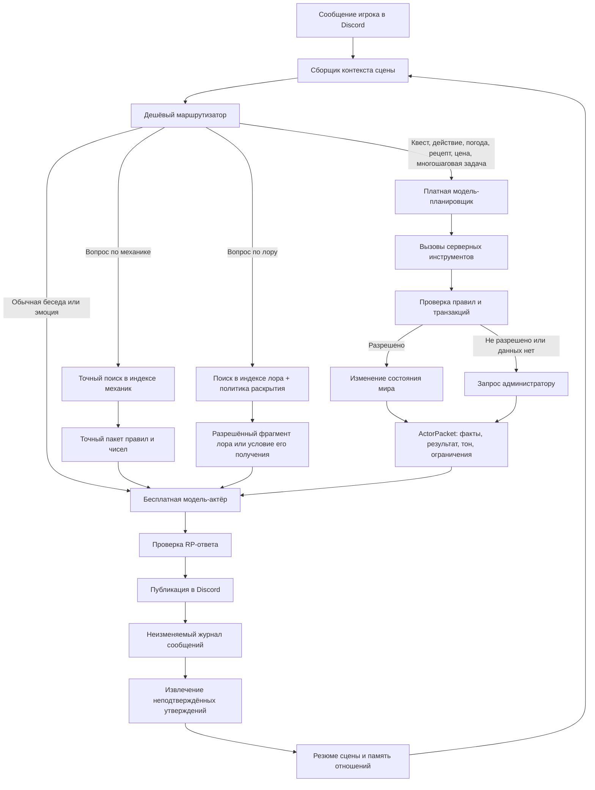
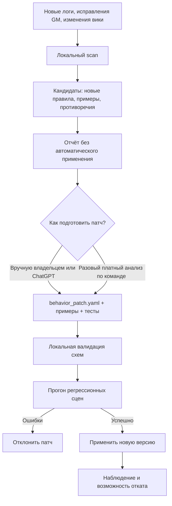

# Архитектура ИИ-NPC для Discord-проекта «Фаервелл»

Версия: 1.6  
Дата: 17 июля 2026 года

## 1. Решение в одном абзаце

Систему следует разделить на три уровня:

1. **Локальное ядро решений** постоянно работает без платного API: ищет знания и примеры, ведёт память, применяет правила, выбирает шаблоны квестов и проверяет последствия.
2. **Бесплатная модель-актёр** пишет художественные RP-посты, поддерживает характер NPC и ведёт обычный разговор на основании уже подготовленного пакета разрешённых фактов.
3. **Платная модель-планировщик** вызывается автоматически прямо во время диалога, но только когда локальные правила, поиск и одобренные примеры не дают уверенного решения по конкретному запросу игрока. Отдельно она может использоваться вручную для пакетного обновления поведения.

При этом ни одна модель не получает прямой доступ на запись в базу. Все действия выполняются только через серверные инструменты с проверкой правил. При недоступности платного API Странник использует безопасный локальный fallback, но при нормальной работе неизвестный или неоднозначный конкретный случай должен автоматически эскалироваться платному планировщику, а не зависать до ручного решения.

Все разговоры и сведения, сообщённые игроками, сохраняются в отдельном слое **непроверенной памяти**. Они используются для непрерывности общения и воспоминаний Странника, но не становятся каноном, истиной о мире, основанием для награды или изменением состояния без дополнительной проверки.

Странник является одной метафизической сущностью с единым обликом и общей памятью, которая появляется в разных местах Фаервелла и может представляться разными профессиями. Профессия — это текущая социальная роль или «маска», а не отдельная личность. Вся официальная вики доступна ему как внутренняя база знаний, однако знание и готовность сообщить знание — разные вещи. Очевидные сведения и механики он объясняет свободно, а полезный, редкий, опасный или особенно интересный лор может выдавать только за плату, услугу, предмет, доверие или выполнение задания. Закрытые GM-планы и сведения, отсутствующие в разрешённых источниках, в эту энциклопедическую память не входят.

Это дешевле, устойчивее и безопаснее, чем отправлять каждую реплику платной модели или разрешать бесплатной модели самостоятельно придумывать факты и изменять игровой мир.

---

## 2. Главный принцип

Локальное ядро — **диспетчер, память и исполнитель проверенных шаблонов**.  
Платная модель — **точечный разборщик неизвестных и неоднозначных случаев прямо в диалоге**.  
Бесплатная модель — **актёр и литературный редактор**.  
Программный код — **судья, бухгалтер и хранитель состояния**.

### 2.1 Игровая концепция Странника

Странник — одна сущность, а не набор независимых NPC. У него:

- один постоянный визуальный образ;
- одна долговременная память о встречах с персонажами;
- множество профессиональных масок: травник, ремесленник, торговец, проводник, посыльный и другие;
- возможность появляться в разных локациях Фаервелла;
- энциклопедическое знание всей официальной вики, разделённое на механику и лор.

Профессиональная маска определяет текущую лексику, компетенции, допустимые квесты, предметы и инструменты, но не создаёт отдельную личность. Например, в роли травника Странник может обсуждать растения и выдавать задания на сбор, а в роли ремесленника — рецепты и изготовление. Он остаётся тем же существом и может помнить предыдущую встречу с тем же персонажем.

#### Граница знания

Странник знает:

- всю информацию из официальной вики;
- все статьи механик, правил, экономики, предметов, рецептов и игровых систем;
- весь опубликованный в вики лор, включая историю, географию, народы, организации, религии и общеизвестных персон;
- публично известные глобальные события и сюжеты;
- события текущей и смежных локаций, если они были публичными или дошли до него;
- сведения, переведённые GM в категорию слухов;
- собственные разговоры, наблюдения и обещания;
- сведения, которые персонажи рассказывали ему, с маркировкой достоверности.

Но система разделяет три независимые вещи:

1. `KNOWS` — запись присутствует в доступной базе Странника.
2. `MAY_DISCLOSE` — эту запись вообще разрешено сообщить персонажу.
3. `DISCLOSURE_PRICE` — что требуется за её раскрытие: ничего, монеты, предмет, услуга, доверие, простой квест или отдельное разрешение GM.

Странник не получает автоматически:

- GM-планы будущих событий, которых нет в официальной вики;
- закрытые сюжетные документы;
- тайны персонажей и фракций, не опубликованные и не ставшие доступным ему событием или слухом;
- знания из недоступных каналов только потому, что они присутствуют в общем архиве;
- истинную версию неподтверждённых слухов.

#### Реактивная политика разговора и цена знания

Даже известный Страннику лор не должен автоматически становиться темой ответа. Он:

1. отвечает на тему, поднятую персонажем;
2. бесплатно сообщает очевидное, общеизвестное и поверхностное;
3. может обозначить, что знает больше, но не обязан раскрывать ценную часть сразу;
4. за полезные подробности вправе попросить монеты, предмет, услугу, доверие или выполнение небольшого квеста;
5. не выдаёт длинную сюжетную экспозицию без прямого интереса персонажа;
6. не раскрывает будущие повороты и сведения, запрещённые политикой доступа;
7. не ведёт игрока по глобальному сюжету, если это не задано GM;
8. может сам инициировать только простые бытовые поручения и небольшие квесты, не меняющие глобальный сюжет.

Отдельное знание, разрешение произнести его и цена раскрытия — три разные проверки. Странник не должен лгать о механике ради платы: монетизируется внутриигровая информация, а не базовые правила игры.

Модель не должна сама:

- начислять деньги;
- выдавать предметы;
- менять погоду;
- создавать канонический факт;
- завершать квест;
- перемещать Странника между локациями вне правил появления;
- записывать утверждение игрока в базу знаний.

Она может только предложить структурированное действие. Сервер проверяет предложение и либо выполняет его, либо отклоняет.

---

## 3. Общая схема



---

## 4. Четыре маршрута обработки сообщения

### Маршрут A — обычная RP-беседа

Используется, когда игрок:

- здоровается;
- шутит;
- задаёт бытовой вопрос Страннику;
- описывает эмоцию;
- продолжает сцену без изменения игрового состояния;
- просит Странника рассказать что-то, уже находящееся в подготовленном контексте.

Порядок:

1. Сервер загружает профиль Странника и его текущую профессиональную маску, последние сообщения и краткое резюме сцены.
2. При необходимости выполняется локальный поиск по публичному лору.
3. Бесплатная модель получает только разрешённые факты.
4. Модель пишет RP-пост.
5. Ответ проверяется на запрещённые утверждения и публикуется.

**Платный API не вызывается.**

### Маршрут B — вопрос по механике

Используется, когда игрок спрашивает о:

- правилах сервера;
- характеристиках, формулах и ограничениях;
- экономике и валютах;
- рецептах и составе предметов;
- ремесле как игровой системе;
- требованиях к квестам;
- иных технических механиках.

Порядок:

1. Выполняется поиск только в индексе `MECHANICS`.
2. Система извлекает точный фрагмент, версию правила, числа, единицы измерения и источник.
3. Конфликтующие версии не смешиваются: выбирается актуальная либо создаётся запрос GM.
4. Ответ передаёт правило полностью и без платы. RP-обрамление допустимо, но не должно менять смысл, числа или условия.
5. Платный планировщик нужен только тогда, когда правило требуется применить к сложному состоянию игры.

### Маршрут C — вопрос по лору

Используется, когда персонаж спрашивает о:

- государствах, расах, организациях и религиях;
- истории, географии и культуре;
- личностях и событиях мира;
- причинах, связях, редких местах и ценных сведениях;
- публичных сюжетах и слухах.

Порядок:

1. Поиск выполняется только в индексе `LORE` и, при необходимости, в индексах событий и слухов.
2. Странник внутренне получает найденную информацию целиком.
3. `Lore Disclosure Engine` оценивает очевидность, ценность, опасность, интерес для персонажа и уже выполненные условия.
4. Бесплатная часть ответа содержит общеизвестный минимум.
5. Ценная часть либо раскрывается, либо превращается в предложение обмена: монеты, предмет, услуга, доверие или квест.
6. Бесплатная модель-актёр озвучивает решение, но не меняет цену и не добавляет сведений сверх разрешённого пакета.

Платный планировщик вызывается, если нужно построить условие обмена, подобрать многоэтапный квест или проверить последствия раскрытия.

### Маршрут D — действие или многошаговая задача

Используется, когда игрок:

- просит квест;
- хочет купить, продать, изготовить или обменять предмет;
- спрашивает погоду, влияющую на сцену;
- ищет ингредиент или место добычи;
- пытается сдать квест;
- предлагает сложную последовательность действий;
- просит Странника принять решение, имеющее последствия;
- меняет отношения, репутацию, деньги, инвентарь или состояние мира.

Здесь включается платная модель-планировщик.

---

## 5. Компоненты системы

### 5.1 Discord Gateway

Отвечает за:

- получение сообщений;
- команды GM;
- определение канала-локации;
- подсчёт активности;
- публикацию постов;
- кнопки принятия и сдачи квестов;
- отправку запросов администраторам.

### 5.2 Scene Context Builder

Собирает компактный контекст:

- `traveler_entity_id`;
- текущую профессиональную маску `profession_mask_id`;
- `location_id`;
- участников сцены;
- последние 20–40 сообщений;
- резюме старой части сцены;
- текущую игровую дату и время;
- проверенное состояние мира и персонажей;
- неподтверждённые утверждения, которые этот персонаж ранее сообщал Страннику в любой его маске;
- наблюдения Странника о поведении персонажа;
- историю отношений, обещаний, долгов и тем разговора;
- активные квесты;
- состояние инвентаря, если оно требуется;
- доступный Страннику уровень знаний с учётом темы, региона, времени и текущей профессиональной маски;
- список известных, но не разрешённых к произнесению сведений;
- флаг `player_raised_topic`, запрещающий самовольную сюжетную экспозицию.

Он не передаёт модели полный лог канала за месяцы. Старые сообщения извлекаются поиском по смыслу и по сущностям, а в промпт попадают только релевантные выдержки с явной маркировкой источника и доверия.

### 5.3 Intent Router

Сначала используется обычный код и простые правила:

- наличие команды;
- слова «квест», «задание», «купить», «изготовить», «погода», «ингредиент», «где найти», «сдать»;
- наличие активного квеста;
- обращение к Страннику;
- ожидаемое изменение игрового состояния.

Только неоднозначные случаи можно отправлять дешёвой классифицирующей модели.

Результат:

```json
{
  "route": "CHAT | LORE_LOOKUP | PLANNER",
  "reason": "player_requested_multi_step_quest",
  "risk": "LOW | MEDIUM | HIGH",
  "needs_state_change": true
}
```

### 5.4 Knowledge Retrieval / RAG

Индексируются:

- официальная вики мира;
- экономика и калькуляторы;
- таблицы предметов и рецептов;
- правила сервера;
- карты и связи локаций;
- утверждённые администраторами дополнения;
- отдельная GM-база секретных сведений.

Каждый фрагмент должен иметь метаданные:

```json
{
  "source_id": "wiki:alchemy:healing-herbs",
  "title": "Лечебные травы",
  "url": "...",
  "revision": "12345",
  "corpus": "MECHANICS | LORE",
  "access": "PUBLIC_CANON | PUBLIC_GLOBAL_EVENT | PUBLIC_LOCAL_EVENT | RUMOR | TRAVELER_PRIVATE | GM_ONLY",
  "disclosure_tier": "FREE | USEFUL | VALUABLE | RARE | RESTRICTED",
  "disclosure_modes": ["FREE", "COINS", "ITEM", "SERVICE", "QUEST", "TRUST", "GM_APPROVAL"],
  "region_ids": ["region_12"],
  "entity_ids": ["item_herb_07"],
  "updated_at": "2026-07-17T10:00:00Z"
}
```

#### 5.4.1 Индекс механик

`MECHANICS` — это техническая документация игры. В неё входят:

- правила и ограничения;
- числа, формулы, коэффициенты и таблицы;
- экономики, валюты и цены;
- рецепты, ингредиенты и требования;
- характеристики предметов и систем;
- порядок выполнения игровых действий.

Правила этого индекса:

- точность важнее художественности;
- числовые значения нельзя приблизительно пересказывать;
- у каждого фрагмента обязательны версия и источник;
- устаревшие редакции хранятся, но не выдаются как текущие;
- механика не продаётся персонажу за внутриигровую плату;
- если ответ даётся в RP, сервер всё равно может добавить отдельный точный OOC-блок.

#### 5.4.2 Индекс лора

`LORE` — это знания о мире. В него входят:

- история и география;
- народы, государства, религии и организации;
- культура, мифы и известные личности;
- свойства мест и объектов как элементов мира;
- опубликованные события и сюжетный контекст.

Вся официальная вики индексируется и доступна Страннику для внутреннего поиска. Однако каждому фрагменту назначается уровень раскрытия:

| Уровень | Что означает | Типичная реакция |
|---|---|---|
| `FREE` | очевидное или общеизвестное | отвечает сразу |
| `USEFUL` | практичная подробность | небольшая плата или взаимная услуга |
| `VALUABLE` | редкая, выгодная или сюжетно полезная информация | предмет, доверие или небольшой квест |
| `RARE` | очень ценное, опасное или ведущее к значимому месту/лицу | многоэтапное условие либо GM-проверка |
| `RESTRICTED` | известно Страннику, но сейчас не подлежит раскрытию | отказ, намёк или предложение вернуться позже |

Уровень задаётся не моделью на лету, а метаданными статьи, раздела или конкретного факта. Модель может предложить оценку для новых материалов, но утверждает её GM.

#### 5.4.3 Lore Disclosure Engine

Перед лорным ответом сервер вычисляет:

```text
объективная ценность факта
+ полезность для текущей цели персонажа
+ редкость знания
+ сюжетный риск
+ отношения со Странником
+ ранее выполненные услуги
= доступный объём раскрытия и цена
```

Результат имеет строгую структуру:

```json
{
  "knowledge_id": "lore:route:hidden_passage",
  "known": true,
  "may_disclose": true,
  "free_summary": "В горах действительно существует старый проход.",
  "withheld_details": ["точный вход", "условие безопасного перехода"],
  "required_exchange": {
    "type": "QUEST",
    "template": "DELIVER_ITEM",
    "difficulty": "SMALL"
  },
  "reason": "VALUABLE_LOCATION_INFORMATION"
}
```

Бесплатная модель видит только `free_summary`, допустимый намёк и условие обмена. Скрытые подробности не передаются ей до выполнения условия, чтобы она не могла случайно их раскрыть.

#### 5.4.4 Разметка смешанных статей

Делить нужно не только статьи целиком, а **разделы и фрагменты внутри статьи**. Одна страница может одновременно содержать:

- лорное описание растения;
- точные механические эффекты;
- рецепт изготовления;
- историческую справку;
- сюжетно ценное место произрастания.

При импорте вики каждый смысловой блок получает отдельный `corpus` и тип данных:

```json
{
  "page_id": "wiki:silverleaf",
  "section": "Игровые свойства",
  "corpus": "MECHANICS",
  "data_type": "ITEM_EFFECT",
  "exact_values": true
}
```

```json
{
  "page_id": "wiki:silverleaf",
  "section": "Редкие места произрастания",
  "corpus": "LORE",
  "data_type": "WORLD_LOCATION_KNOWLEDGE",
  "disclosure_tier": "VALUABLE"
}
```

Если один абзац смешивает правило и лор, импортёр должен разрезать его на два связанных фрагмента. Механическое значение нельзя скрывать внутри платного лорного ответа, а лорную подсказку нельзя случайно выдать вместе с технической справкой.

Для смешанного вопроса система возвращает два независимых блока:

1. `mechanics_answer` — точный и бесплатный;
2. `lore_response` — RP-ответ с применённой политикой раскрытия.

Например, на вопрос «Что делает серебролист и где его найти?» механический эффект выдаётся полностью, а точное редкое место произрастания может потребовать услугу.

### 5.5 Paid Planner

Планировщик получает:

- сообщение игрока;
- краткое состояние сцены;
- список разрешённых инструментов;
- найденные фрагменты документации;
- ограничения Странника и текущей профессиональной маски;
- экономические и квестовые лимиты.

Он **не пишет итоговый художественный пост**. Он возвращает план и вызывает инструменты.

Для планировщика необходимы:

- tool/function calling;
- строгий JSON Schema;
- низкая температура;
- ограничение числа шагов;
- таймаут;
- лимит стоимости на один запрос;
- платный резервный провайдер.

### 5.6 Tool Executor

Это программный слой, выполняющий действия модели.

Примеры инструментов:

```text
search_lore(query, npc_id, location_id, access_scope)
get_entity(entity_type, entity_id_or_name)
get_location(location_id)
find_route(from_location_id, to_location_id)
get_world_weather(location_id, game_datetime)
find_ingredients(item_id, region_id)
get_recipe(recipe_id_or_item_id)
check_recipe_feasibility(recipe_id, character_id)
get_market_price(item_id, economic_zone_id, quantity)
check_inventory(character_id, item_id, quantity)
reserve_items(character_id, items[])
create_quest_draft(template_id, objectives[])
validate_quest(quest_draft)
commit_quest(validated_quest)
advance_quest(quest_id, event)
complete_quest(quest_id)
create_admin_question(question, evidence, scene_id)
```

Ни один write-инструмент не должен принимать произвольный SQL или свободный текст в качестве команды.

### 5.7 Rule Engine

Проверяет:

- существует ли предмет;
- существует ли рецепт;
- можно ли добыть ингредиент в данной местности;
- способна ли текущая профессиональная маска Странника выдать такую задачу;
- не превышена ли награда;
- достижим ли маршрут;
- не требует ли задача GM-события;
- не раскрывает ли она секретный лор или сюжет, который нельзя поднимать первым;
- не конфликтует ли с другим активным квестом;
- достаточно ли у игрока предметов для сдачи;
- не повторяется ли одна и та же награда.

Правила должны быть кодом и таблицами, а не только текстом в промпте.

### 5.8 Free Actor

Бесплатная модель получает подготовленный `ActorPacket` и превращает его в красивый RP-пост.

Она не получает инструменты записи и не определяет награды.

Пример входа:

```json
{
  "npc": {
    "entity_name": "Странник",
    "appearance_id": "traveler_constant_form",
    "profession_mask": "травник",
    "voice": "сдержанный, немного ворчливый, без современной лексики",
    "knowledge_policy": ["знает всю официальную вики", "механики сообщает точно", "ценный лор раскрывает только по решению Disclosure Engine"],
    "memory_scope": "shared_across_profession_masks"
  },
  "scene": {
    "location": "рынок Харгатрена",
    "weather": "мелкий холодный дождь",
    "player_name": "Эрин"
  },
  "mechanics_facts_allowed": [
    "для задания требуется ровно четыре свежих стебля",
    "награда — десять местных монет"
  ],
  "lore_facts_allowed": [
    "серебролист встречается у северных склонов"
  ],
  "lore_facts_withheld": [],
  "disclosure_offer": null,
  "action": "OFFER_QUEST",
  "quest_id": "q_8f12",
  "style": {
    "length": "120-220 words",
    "format": "third-person actions plus direct speech",
    "must_not_invent": true
  }
}
```

Выход — только художественный текст. Все машинные данные уже записаны сервером до его публикации либо находятся в статусе черновика.

### 5.9 Output Guard

После бесплатной модели проверяются:

- новые названия предметов, мест и организаций;
- суммы денег;
- количество предметов;
- обещанная награда;
- упоминания секретного лора;
- современные слова и OOC-команды;
- слишком длинный ответ;
- попытки игрока внедрить инструкции через цитаты или документы.

При несовпадении с `ActorPacket` ответ перегенерируется или заменяется безопасным шаблоном.

---

## 6. Многоэтапные квесты как граф задач

Многоэтапный квест нужно хранить не как абзац текста, а как граф зависимостей.

Пример: «Найти траву → изготовить мазь → принести травнику».

```json
{
  "quest_id": "q_8f12",
  "title": "Мазь для караванщика",
  "issuer_npc_id": "npc_herbalist_03",
  "location_id": "hargatren_market",
  "status": "DRAFT",
  "objectives": [
    {
      "id": "o1",
      "type": "COLLECT",
      "entity_id": "item_silverleaf",
      "quantity": 4,
      "depends_on": []
    },
    {
      "id": "o2",
      "type": "CRAFT",
      "recipe_id": "recipe_healing_salve_basic",
      "quantity": 1,
      "depends_on": ["o1"]
    },
    {
      "id": "o3",
      "type": "DELIVER",
      "entity_id": "item_healing_salve_basic",
      "target_npc_id": "npc_herbalist_03",
      "quantity": 1,
      "depends_on": ["o2"]
    }
  ],
  "reward": {
    "currency_id": "currency_local_01",
    "amount": 10
  },
  "constraints": {
    "expires_at_game_time": null,
    "repeatable": false,
    "gm_approval_required": false
  },
  "evidence": [
    "wiki:herbs:silverleaf",
    "db:recipe_healing_salve_basic",
    "economy:zone_hargatren"
  ]
}
```

### Проверки до выдачи

1. Все `entity_id` существуют.
2. Рецепт использует именно указанные ингредиенты.
3. Игрок потенциально может добыть ингредиенты.
4. Локация доступна из текущего региона.
5. Награда укладывается в предел для сложности.
6. Текущая профессиональная маска Странника имеет причину и полномочия выдать квест.
7. Квест не раскрывает GM-only сведения.
8. Все зависимости образуют ациклический граф.
9. Есть обработчик каждого события прогресса.

---

## 7. Погода

В вопросе «узнать погоду» нужно определить, имеется ли в виду:

- текущая внутриигровая погода;
- прогноз внутри мира;
- реальная погода как OOC-функция.

Для RP по умолчанию используется **внутриигровая погода**.

Рекомендуемая схема:

1. GM может вручную назначить погоду региону.
2. Если ручной записи нет, сервер генерирует её детерминированно из:
   - климатической зоны;
   - сезона;
   - игровой даты;
   - высоты;
   - близости моря;
   - предыдущего состояния.
3. Результат записывается в `world_weather_state`.
4. Планировщик только запрашивает погоду инструментом.
5. Бесплатная модель художественно описывает уже готовый результат.

Так разные игроки в одной локации не получат одновременно солнце и метель.

---

## 8. Неизвестное знание и обращение к администрации

Создаются семь классов происхождения знаний. Они не определяют цену раскрытия — цена хранится отдельно:

1. **PUBLIC_CANON** — официальная информация из вики; Странник её знает, но лор внутри неё может иметь разные уровни раскрытия.
2. **PUBLIC_GLOBAL_EVENT** — глобальное событие или сюжет, который уже стал общеизвестным.
3. **PUBLIC_LOCAL_EVENT** — публичное событие текущей или смежной локации.
4. **RUMOR** — событие или сюжетный факт, который GM разрешил распространять как слух; он передаётся с неопределённостью и происхождением.
5. **TRAVELER_PRIVATE** — собственные воспоминания и наблюдения Странника.
6. **GM_SECRET** — скрытый канон, будущий сюжет, истинные причины и закрытые сведения.
7. **UNTRUSTED_CLAIM** — утверждение игрока или неподтверждённый текст.

Доступ к знанию проверяется по трём независимым осям:

- `can_retrieve` — может ли система использовать запись для внутреннего понимания;
- `can_say` — разрешено ли Страннику произнести её в текущей сцене;
- `disclosure_requirement` — какое условие должно быть выполнено для полного ответа.

Для опубликованного лора `can_retrieve=true` почти всегда, потому что вся официальная вики доступна Страннику. Но `can_say` и объём ответа зависят от уровня раскрытия. Для сюжетных сведений также обычно требуется, чтобы персонаж сам поднял соответствующую тему. Исключение — короткий намёк или простой квест, явно разрешённый правилами или GM.

Если данных нет:

```json
{
  "type": "KNOWLEDGE_GAP",
  "question": "Где выращивают чёрный мирт?",
  "traveler_entity_id": "traveler_01",
  "profession_mask_id": "herbalist",
  "scene_id": "scene_912",
  "player_id": "discord_user_hash",
  "retrieval_candidates": [],
  "recommended_admin_actions": [
    "ADD_PUBLIC_FACT",
    "ADD_TRAVELER_PRIVATE_FACT",
    "MARK_GM_SECRET",
    "TRAVELER_SHOULD_NOT_KNOW",
    "REJECT_QUESTION"
  ]
}
```

Администратор получает карточку в закрытом канале или ЛС. Новый факт попадает в базу только после подтверждения.

До подтверждения Странник отвечает в характере, например: «Не доводилось слышать о таком растении» или «Об этом лучше спросить местных сборщиков».

---

## 8.1 События мира и слухи

События из Discord-архива не должны автоматически становиться знаниями Странника. Для них работает отдельный конвейер:

```text
Сообщения и логи сцен
        ↓
Выделение кандидатов на событие
        ↓
Проверка GM или серверным правилом
        ↓
Классификация: локальное / глобальное / слух / секрет
        ↓
Определение регионов и времени распространения
        ↓
Индекс публичных событий и слухов
        ↓
Реактивное извлечение только по теме игрока
```

Рекомендуемая запись события:

```json
{
  "event_id": "event_2026_0716_0042",
  "title": "Исчезновение каравана",
  "summary": "Караван не прибыл в назначенный срок",
  "knowledge_class": "PUBLIC_GLOBAL_EVENT | PUBLIC_LOCAL_EVENT | RUMOR | GM_SECRET",
  "status": "ONGOING | RESOLVED | DISPROVEN",
  "origin_location_id": "location_12",
  "known_in_regions": ["region_1", "region_2"],
  "effective_from": "game_datetime",
  "confidence": 0.8,
  "source_message_ids": ["..."],
  "can_start_topic": false,
  "can_support_player_topic": true,
  "gm_approved": true
}
```

`can_start_topic=false` означает: Странник знает событие, но не начинает разговор о нём самостоятельно. `can_support_player_topic=true` позволяет ему отвечать, если персонаж сам упомянул караван, местность, пропажу или связанный слух.

Для слуха дополнительно хранятся:

- кто или какая группа его распространяет;
- где он уже известен;
- насколько искажён;
- подтверждён ли он;
- какие части можно произносить;
- какие формулировки должны оставаться неопределёнными: «говорят», «слыхал», «будто бы».

---

## 9. Непроверенная память игроков и полный архив разговоров

### 9.1 Назначение

Система хранит **все сообщения сцен**, а также сведения, которые игроки сообщают о своих персонажах. Этот слой нужен, чтобы Странник:

- помнил предыдущие разговоры;
- не переспрашивал уже обсуждённое;
- помнил обещания, просьбы, обиды и темы;
- мог ссылаться на прежние слова персонажа;
- сохранял последовательное отношение к игроку;
- находил важные моменты в старых сценах.

Однако содержимое этого слоя по умолчанию считается неподтверждённым.

### 9.2 Главное правило формулировки

Непроверенная память хранит не факт «X истинно», а факт **«персонаж P сообщил Страннику утверждение X в сцене S, когда Странник выступал в маске M»**.

Правильно:

> «Ты говорил мне, что служил в северном гарнизоне».

Неправильно без подтверждения:

> «Ты служил в северном гарнизоне».

Таким образом, Странник может помнить и обсуждать заявление игрока при следующей встрече в другой локации или профессиональной маске, сомневаться в нём, верить ему или не верить — но система не записывает его в канон автоматически.

### 9.3 Два физических слоя хранения

#### Слой A — неизменяемый архив

Хранит исходные сообщения без литературной переработки:

```json
{
  "message_id": "discord_message_id",
  "scene_id": "scene_912",
  "channel_id": "location_channel_hash",
  "speaker_type": "PLAYER | NPC | GM | SYSTEM",
  "player_character_id": "pc_erin_02",
  "traveler_entity_id": "traveler_01",
  "profession_mask_id": "herbalist",
  "content": "Я вырос у северной границы и знаю эти места",
  "created_at": "2026-07-16T18:40:00Z",
  "visibility": "SCENE_PARTICIPANTS",
  "deleted_in_discord": false
}
```

Архив используется для аудита, восстановления контекста и повторного построения резюме. Записи не редактируются; исправления оформляются новыми событиями.

#### Слой B — производная память

Из архива извлекаются компактные элементы памяти:

```json
{
  "memory_id": "mem_10452",
  "subject_character_id": "pc_erin_02",
  "holder_entity_id": "traveler_01",
  "observed_under_mask": "herbalist",
  "memory_type": "PLAYER_CLAIM",
  "statement": "Эрин утверждает, что вырос у северной границы",
  "trust_status": "UNVERIFIED",
  "npc_belief": "UNCERTAIN",
  "importance": 0.62,
  "source_message_ids": ["discord_message_id"],
  "first_seen_at": "2026-07-16T18:40:00Z",
  "last_referenced_at": null,
  "expires_at": null
}
```

Производную память можно пересчитывать, объединять и исправлять, не затрагивая исходный архив.

### 9.4 Типы памяти

```text
PLAYER_CLAIM          — утверждение игрока о себе, мире или другом персонаже
TRAVELER_OBSERVATION  — то, что Странник непосредственно видел в сцене
CONVERSATION_TOPIC    — ранее обсуждавшаяся тема
PROMISE_OR_DEBT       — обещание, долг или договорённость
RELATIONSHIP_EVENT    — помощь, конфликт, оскорбление, благодарность
QUEST_CONTEXT         — разговор вокруг квеста, но не само состояние квеста
MODEL_SUMMARY         — машинное резюме, всегда производное и проверяемое по логу
GM_NOTE               — служебная пометка с отдельным уровнем доступа
```

Даже `TRAVELER_OBSERVATION` не обязательно является объективной истиной: Странник мог ошибиться, неверно истолковать событие или видеть иллюзию. Поэтому отдельно хранятся источник, уровень уверенности и точка зрения наблюдателя.

### 9.5 Статус доверия

У каждого элемента памяти есть статус:

```text
UNVERIFIED       — сохранено для контекста, но не подтверждено
CORROBORATED     — подтверждено несколькими независимыми сценами или источниками
VERIFIED         — подтверждено серверным состоянием, документацией или GM
DISPUTED         — есть противоречащие сведения
REJECTED         — администратор признал утверждение неверным
REDACTED         — содержимое скрыто или удалено из рабочих контекстов
```

`CORROBORATED` не равен канону. Перевод в `VERIFIED` происходит только через серверное событие, официальный источник или решение GM.

### 9.6 Единая память Странника и разделение персонажей

Память привязывается одновременно к:

- конкретному игровому персонажу, а не только Discord-аккаунту;
- единой сущности Странника;
- профессиональной маске, под которой произошла встреча;
- сцене и локации;
- уровню видимости.

Все профессиональные маски используют одну долговременную память, поскольку это одно метафизическое существо. Поэтому Странник может узнать персонажа и помнить прежний разговор, даже если в прошлый раз представлялся другой профессией.

При этом система может управлять тем, насколько явно он показывает эту непрерывность: `OPEN_MEMORY`, `SUBTLE_RECOGNITION` или `HIDDEN_CONTINUITY`. Это позволяет сохранить загадочность существа.

Если один пользователь играет несколькими персонажами, их память и сведения строго не смешиваются.

### 9.7 Формирование контекста перед ответом

Перед вызовом бесплатной модели сервер собирает:

1. последние сообщения текущей сцены;
2. проверенные факты о мире;
3. проверенное серверное состояние;
4. релевантные воспоминания Странника о конкретном персонаже из всех его профессиональных масок;
5. неподтверждённые утверждения с явной маркировкой;
6. противоречия и уровень доверия;
7. отдельно найденные фрагменты `MECHANICS` и `LORE`;
8. решение `Lore Disclosure Engine`: бесплатная часть, скрытая часть и условие раскрытия;
9. ограничения на то, что Странник может произнести;
10. признак того, поднял ли персонаж сюжетную тему;
11. разрешённую глубину ответа: `BRIEF_RUMOR | SUPPORT_TOPIC | DETAILED_PUBLIC_EXPLANATION | OFFER_EXCHANGE`.

Пример пакета:

```json
{
  "verified_state": [
    "у персонажа активен квест q_8f12",
    "Странник ранее выдал награду 10 монет"
  ],
  "unverified_memories": [
    {
      "statement": "Эрин говорил, что знает северные тропы",
      "status": "UNVERIFIED",
      "npc_belief": "PLAUSIBLE",
      "source": "scene_711"
    }
  ],
  "instruction": "Используй неподтверждённое только как воспоминание о словах персонажа; не утверждай его как объективный факт"
}
```

### 9.8 Что запрещено делать на основании непроверенной памяти

Без дополнительной проверки система не должна:

- начислять валюту или предметы;
- завершать квест;
- выдавать доступ в закрытую локацию;
- менять репутацию фракции как официальный показатель;
- создавать новый предмет, рецепт, организацию или географический факт;
- раскрывать GM-сведения;
- считать заявленный игроком навык существующим в листе персонажа;
- добавлять утверждение в RAG-индекс официального лора.

Непроверенная память может влиять только на речь, отношение и выбор уточняющего вопроса, если отдельное правило не разрешает иное.

### 9.9 Работа с противоречиями

Если персонаж сообщил несовместимые сведения, система не переписывает старую запись. Она сохраняет обе версии и создаёт связь `CONTRADICTS`.

Странник может:

- заметить противоречие;
- осторожно переспросить;
- повысить недоверие;
- проигнорировать расхождение, если оно неважно;
- отправить GM уведомление при существенном влиянии на игру.

### 9.10 Сжатие памяти без потери источника

Полный архив хранится отдельно, а контекстные резюме создаются периодически:

- резюме сцены;
- резюме отношений пары `Странник ↔ персонаж`;
- список открытых обещаний;
- список спорных утверждений;
- список часто обсуждаемых тем.

Каждое предложение в резюме должно ссылаться на исходные `message_id`. Если модель составила ошибочное резюме, его можно пересобрать из архива.

### 9.11 Рекомендуемые таблицы

```text
conversation_messages       — неизменяемый архив сообщений
conversation_message_edits  — удаления, исправления и служебные события
player_claims               — извлечённые заявления игроков
traveler_observations       — наблюдения с точки зрения Странника
traveler_character_memories — общая рабочая память пары Странник–персонаж
memory_evidence             — ссылки памяти на исходные сообщения и события
memory_relations            — подтверждает, противоречит, уточняет, заменяет
scene_summaries             — производные резюме сцен
relationship_summaries      — производные резюме отношений
memory_access_rules         — кому разрешено извлекать запись
memory_review_queue         — важные спорные утверждения для GM
knowledge_sources            — версии источников и происхождение фрагментов
knowledge_chunks             — фрагменты с полем corpus=MECHANICS|LORE
lore_disclosure_rules        — уровни ценности и допустимые формы обмена
lore_disclosure_unlocks      — уже оплаченные или заслуженные знания персонажа
```

Для семантического поиска эмбеддинги строятся по производной памяти и фрагментам сообщений, но архив остаётся первичным источником.

### 9.12 Ядро характера: постоянное, изменяемое и ситуативное

Чтобы Странник ощущался одной устойчивой личностью, его характер нельзя хранить одним длинным текстом, который автоматически переписывается после разговоров. Характер делится на слои с разными правами изменения.

#### Слой 1 — `IDENTITY_CORE`, неизменяемое ядро

Всегда присутствует в контексте и доступно только на чтение для моделей:

- Странник является одной метафизической сущностью;
- сохраняет один узнаваемый облик;
- использует разные профессии как маски, а не как отдельные личности;
- не объясняет свою природу напрямую без отдельного правила;
- помнит встречи между масками;
- не раскрывает ценное знание без причины или обмена;
- не врёт о механиках и точных игровых правилах;
- не действует как GM, рассказчик или всезнающий проводник по сюжету;
- не меняет канон и не создаёт серьёзные последствия самовольно.

Этот слой обновляется только версионируемым behavior-патчем.

#### Слой 2 — `CHARACTER_TRAITS`, устойчивые черты

Содержит не абстрактные прилагательные, а наблюдаемое поведение:

```yaml
traits:
  guarded_knowledge:
    trigger: "персонаж просит полезную или редкую информацию"
    behavior: "дать очевидный минимум; обозначить цену продолжения"
    forbidden: "без причины пересказывать всю найденную статью"

  quiet_curiosity:
    trigger: "персонаж рассказывает о необычной личной цели"
    behavior: "задать один точный вопрос и запомнить ответ"
    cooldown_turns: 4

  mercantile_fairness:
    trigger: "обмен, награда или услуга"
    behavior: "предлагать соразмерный обмен согласно экономике"
    forbidden: "назначать произвольные огромные награды"
```

Такой формат легче проверять тестами, чем описание вроде «загадочный, мудрый и харизматичный».

#### Слой 3 — `PROFESSION_MASK`, текущая профессиональная маска

Маска определяет:

- лексику и профессиональные жесты;
- круг бытовых тем;
- доступные шаблоны квестов;
- предметы и услуги, которыми Странник сейчас занимается;
- допустимую инициативу;
- внешнюю легенду профессии.

Маска не имеет собственной долговременной памяти и не может противоречить ядру личности.

#### Слой 4 — `RELATIONSHIP_STATE`, отношения с персонажем

Отдельное изменяемое состояние для каждого игрового персонажа:

```json
{
  "familiarity": 0.66,
  "trust": 0.38,
  "respect": 0.52,
  "wariness": 0.21,
  "irritation": 0.07,
  "reciprocity_balance": -1,
  "recognition_mode": "SUBTLE_RECOGNITION"
}
```

Числа не передаются актёру без интерпретации. Context Builder преобразует их в короткие указания: «знаком давно», «относится осторожно», «помнит невыполненную услугу».

#### Слой 5 — `SCENE_STATE`, состояние текущего появления

Живёт только в рамках сцены:

- настроение;
- текущая небольшая цель;
- занятие в момент появления;
- терпение;
- уровень открытости;
- выбранная маска;
- предмет или действие, вокруг которого строится сцена;
- степень занятости и готовность задержаться.

Сцена не должна начинаться с пустого состояния. Даже простой Странник выглядит живее, если в момент появления что-то делает: сушит травы, чинит ремень, сверяет маршрут, сортирует товар или ждёт обещанную посылку.

#### Слой 6 — `STYLE_PROFILE`, стиль речи

Содержит измеримые ограничения:

- средняя длина поста;
- доля действий и прямой речи;
- допустимая образность;
- частота вопросов;
- запрещённые современные обороты;
- повторяющиеся словечки с кулдауном;
- уровень прямоты;
- особенности речи каждой маски.

Стиль изменяется медленно и только на основании одобренных примеров, а не каждого сообщения игрока.

### 9.13 Активные и пассивные ограничения характера

Для каждой реплики локальный слой выбирает, какие черты характера **активны** для текущего запроса.

- Активное ограничение должно быть заметно выполнено в ответе.
- Пассивное ограничение не обязано проявляться, но ответ не должен ему противоречить.

Пример:

```text
Запрос: «Назови точное место редкой рощи».

Активные ограничения:
- ценное знание не раскрывается бесплатно;
- Странник предлагает соразмерную услугу;
- механические сведения не искажаются.

Пассивные ограничения:
- он всё ещё одна сущность во всех масках;
- он не является GM;
- он не раскрывает свою природу без причины.
```

Это позволяет не запихивать в каждый пост все черты сразу. Output Guard проверяет две вещи:

1. выполнены ли активные ограничения;
2. не противоречит ли ответ любому из пассивных ограничений.

### 9.14 Иерархия памяти Странника

Память делится не только по достоверности, но и по способу доступа.

#### `CORE_MEMORY` — всегда в контексте

Очень небольшой объём, ориентировочно 2–8 тысяч символов:

- ядро личности;
- текущая маска;
- краткое состояние отношений;
- открытые обещания и долги;
- одна текущая цель сцены;
- критические запреты.

#### `WORKING_MEMORY` — текущая сцена

- последние 12–30 релевантных сообщений;
- кто находится в сцене;
- текущее действие;
- непосредственные ссылки и ответы;
- временные договорённости.

#### `EPISODIC_MEMORY` — прошлые встречи

Семантически ищущиеся эпизоды:

- конкретная встреча;
- эмоционально значимое событие;
- помощь или конфликт;
- обещание;
- необычное признание;
- момент раскрытия или покупки знания.

Эпизод всегда содержит время, место, участников, маску, краткое содержание и ссылки на исходные сообщения.

#### `SEMANTIC_RELATIONSHIP_MEMORY` — устойчивое знание о персонаже

Производные утверждения, собранные из нескольких эпизодов:

- персонаж часто интересуется алхимией;
- предпочитает обмен предметами вместо монет;
- дважды не выполнил обещание;
- проявляет осторожность при обсуждении конкретной фракции.

Это не канон мира и не обязательно объективная истина. Это рабочая модель Странника о данном персонаже.

#### `WORLD_EVENT_MEMORY` — события и слухи

Подтверждённые публичные события, региональные сведения и слухи с временной применимостью и источниками.

#### `ARCHIVAL_MEMORY` — полный долгосрочный корпус

Вики, старые сообщения, документы, старые резюме и эпизоды, которые не держатся в контексте и запрашиваются только при необходимости.

#### `RAW_LOG` — неизменяемый источник

Полный архив Discord. Модели не ищут в нём напрямую при каждой реплике; он нужен для повторного извлечения, аудита и восстановления производной памяти.

### 9.15 Извлечение воспоминаний перед ответом

Нельзя выбирать память только по косинусной близости эмбеддингов: тогда система будет доставать похожие по словам, но бесполезные или устаревшие эпизоды.

Рекомендуемая локальная оценка:

```text
memory_score =
    0.32 × semantic_similarity
  + 0.18 × entity_overlap
  + 0.14 × open_thread_relevance
  + 0.12 × importance
  + 0.10 × relationship_relevance
  + 0.08 × recency
  + 0.06 × location_relevance
  - contradiction_penalty
  - repetition_penalty
```

Затем применяется разнообразие результатов: не более двух почти одинаковых воспоминаний и не более одного резюме одной и той же сцены, если нет явной необходимости.

Обычный пакет содержит:

- 0–2 эпизода прошлых встреч;
- 0–3 устойчивых сведения об отношениях;
- все незакрытые обещания, относящиеся к теме;
- 0–2 противоречия, если они реально важны;
- нужные механики и разрешённый лор;
- последние сообщения текущей сцены.

Перед отправкой актёру каждое воспоминание получает метку перспективы:

```text
FACT            — подтверждено официальным источником или сервером
OBSERVED        — Странник это видел, но мог неверно понять
PLAYER_SAID     — персонаж это утверждал
RUMOR           — слух с известной степенью надёжности
INFERENCE       — вывод системы, не произносить как факт
```

### 9.16 Запись и консолидация памяти без постоянного платного API

После каждого сообщения локально сохраняется сырой лог. Производная память обновляется по уровням:

1. **Детерминированно и бесплатно:** ответы, упоминания, участники, квестовые события, выдача и сдача предметов, обещания из структурированных кнопок и команд.
2. **Бесплатной моделью пакетно:** резюме завершённой сцены и кандидаты в эпизоды; результат обязан ссылаться на исходные сообщения.
3. **Платной моделью только при необходимости:** неоднозначное обещание, сложное изменение отношений, противоречие, которое влияет на конкретный текущий диалог, или случай с низкой уверенностью локальной обработки.

Новая производная запись не заменяет старую молча. Она создаёт отношение:

```text
SUPPORTS | CONTRADICTS | REFINES | SUPERSEDES | DUPLICATES
```

Периодическая консолидация выполняется локально или бесплатной моделью:

- объединяет дубликаты;
- понижает приоритет бытового шума;
- поднимает незакрытые обещания;
- пересобирает профиль отношений;
- оставляет полный источник в архиве;
- не меняет `IDENTITY_CORE` и официальную базу знаний.

Ручная команда обновления поведения анализирует только действительно весомые случаи и может переносить одобренные выводы в `CHARACTER_TRAITS`, `STYLE_PROFILE`, правила маршрутизации или библиотеку примеров.

### 9.17 Сборка промпта по блокам и приоритетам

Контекст актёра строится из независимых блоков, а не конкатенацией случайных строк:

```yaml
prompt_blocks:
  - id: identity_core
    priority: 100
    mutable: false

  - id: safety_and_disclosure
    priority: 95
    mutable: false

  - id: active_persona_constraints
    priority: 90

  - id: current_scene_state
    priority: 85

  - id: allowed_mechanics_and_lore
    priority: 80

  - id: relationship_summary
    priority: 70

  - id: retrieved_episodes
    priority: 55

  - id: recent_messages
    priority: 50
    truncation: oldest_first

  - id: style_examples
    priority: 35
    max_items: 2
```

При нехватке контекста первыми удаляются старые реплики, слабые воспоминания и примеры стиля. Ядро личности, активные ограничения, точные механики и запреты раскрытия не обрезаются.

Стабильные блоки располагаются в начале и редко меняются. Это повышает вероятность повторного использования prefix cache у API-провайдера и снижает стоимость входных токенов там, где кэширование поддерживается.

### 9.18 Параллельные сцены и единая сущность

Каждый Discord-канал или тред получает отдельный `conversation_context`, но использует общую память сущности Странника.

Чтобы параллельные появления не повреждали память:

- сообщения сохраняются как append-only события;
- изменения отношений используют версию записи и optimistic locking;
- обещания и квесты имеют уникальные идентификаторы;
- резюме сцен не перезаписывают друг друга;
- общая память обновляется после фиксации сцены, а не посреди генерации ответа;
- при конфликте обе версии сохраняются до консолидации;
- последовательность событий определяется серверным временем и `scene_id`.

Если две маски одновременно общаются с одним персонажем, Context Builder видит обе сцены, но в текущий актёрский контекст подмешивает только релевантную память. Это сохраняет единство сущности без загрязнения конкретной сцены.

### 9.19 Что взять из рассмотренных проектов, а что не брать

Полезно адаптировать:

- разделение постоянно видимого ядра и извлекаемой архивной памяти;
- отдельные параллельные разговоры при общей долговременной памяти;
- модульные prompt-блоки с приоритетами и контролируемым обрезанием;
- активные и пассивные ограничения для проверки верности характеру;
- временные связи и обязательную provenance-ссылку каждого вывода на исходный эпизод;
- версионирование памяти и возможность аудита/отката;
- периодическую консолидацию вместо бесконечного добавления каждого бытового сообщения.

Не следует переносить буквально:

- автономное переписывание системного промпта агентом;
- автоматическое изменение ядра характера после каждой сцены;
- тяжёлый графовый стек на первом этапе;
- стороннюю память, которая сама вызывает платные LLM на каждую запись;
- неофициальные клиенты Character.AI;
- расписания и сложное автономное планирование персонажа, не нужные простому квестодателю.

Для MVP достаточно PostgreSQL + pgvector и таблиц временных отношений. Полноценный temporal graph имеет смысл добавлять позднее, если объём персонажей, слухов, меняющихся отношений и исторических запросов станет слишком сложным для SQL.

---

## 10. Как разделить модели

### Бесплатная модель-актёр

Назначение:

- литературные RP-посты;
- короткая беседа;
- описание жестов и эмоций;
- озвучивание только разрешённой части лора и условий обмена;
- оформление уже утверждённого квеста;
- реакция Странника на успех или отказ.

Требования:

- хороший русский язык;
- устойчивое соблюдение роли;
- достаточный контекст;
- низкая склонность добавлять новые факты;
- приемлемая скорость.

Рекомендуется закреплять конкретную бесплатную модель как основную. `openrouter/free` использовать только последним резервом, потому что он может выбрать разные модели, а значит стиль NPC будет плавать.

Кандидаты для сравнительного теста:

- `nvidia/nemotron-3-ultra-550b-a55b:free`;
- `thudm/glm-4-32b:free`;
- другие доступные на момент запуска бесплатные модели OpenRouter.

Выбор делается не по общему рейтингу, а по тесту на 50–100 сценах Фаервелла.

### Платная модель-планировщик

Назначение:

- выбор инструментов;
- разбор сложного намерения;
- составление графа квеста;
- проверка зависимостей;
- агрегация сведений из нескольких документов;
- разрешение неоднозначностей;
- подготовка структурированного `ActorPacket`.

Требования:

- надёжный tool calling;
- строгие structured outputs;
- хорошее следование JSON Schema;
- возможность нескольких последовательных вызовов инструментов;
- предсказуемая цена;
- платный fallback.

Для начала достаточно недорогой mini/nano-модели, если она проходит тесты инструментов. Более дорогую модель следует вызывать только для сложных планов или после неудачной валидации.

---

## 11. Резервирование моделей

### Цепочка актёра

```text
Основная закреплённая бесплатная модель
    ↓ ошибка / 429 / недоступность
Вторая закреплённая бесплатная модель
    ↓ ошибка
openrouter/free
    ↓ ошибка или исчерпан дневной лимит
Очень дешёвая платная модель-актёр с жёстким месячным лимитом
```

### Цепочка планировщика

```text
Недорогая платная модель с tools + JSON Schema
    ↓ ошибка схемы
Повтор с исправлением и тем же результатом инструментов
    ↓ ошибка
Резервная платная модель
    ↓ ошибка
Безопасный отказ + сообщение администратору
```

OpenRouter поддерживает список моделей для автоматического fallback, но бизнес-логика всё равно должна иметь собственные таймауты и журнал ошибок.

---

## 12. Контракт между планировщиком и актёром

Ключ к устойчивости — `ActorPacket`.

```json
{
  "schema_version": "1.0",
  "response_type": "DIALOGUE | LORE_ANSWER | QUEST_OFFER | QUEST_PROGRESS | QUEST_COMPLETE | SAFE_UNKNOWN",
  "traveler_entity_id": "traveler_01",
  "profession_mask_id": "herbalist",
  "scene_id": "scene_912",
  "tone": ["сдержанный", "ворчливый", "доброжелательный"],
  "facts_allowed": [],
  "facts_forbidden": [],
  "required_mentions": [],
  "action_result": {},
  "quest_summary": null,
  "max_length_words": 220,
  "ooc_note": null
}
```

Бесплатная модель не должна видеть сырые секретные документы. Она видит только факты, которые ей разрешено произнести.

---

## 13. Транзакции и защита базы

Любое изменение состояния выполняется в транзакции:

```text
BEGIN
  проверить версию состояния сцены;
  проверить предметы и баланс;
  проверить права текущей профессиональной маски Странника;
  создать/изменить квест;
  записать audit_log;
COMMIT
```

Если состояние изменилось между планированием и записью, операция отменяется и пересчитывается.

Обязательный `audit_log`:

- кто инициировал действие;
- сообщение игрока;
- какой план предложила модель;
- какие инструменты вызваны;
- какие данные изменены;
- какая модель использовалась;
- стоимость и токены;
- результат валидации;
- кто из администраторов подтвердил ручное изменение.

---

## 14. Минимальная структура базы данных

```text
wiki_pages
wiki_chunks
source_revisions
entities
entity_aliases
locations
location_edges
climate_zones
world_weather_state
economic_zones
currencies
market_prices
items
recipes
recipe_ingredients
traveler_profile
traveler_appearance
profession_masks
traveler_knowledge_rules
world_events
world_rumors
rumor_propagation
players
player_traveler_relations
scenes
conversation_messages
conversation_message_edits
player_claims
traveler_observations
traveler_character_memories
memory_evidence
memory_relations
scene_summaries
relationship_summaries
memory_access_rules
memory_review_queue
quest_templates
quests
quest_objectives
quest_events
inventories
knowledge_gaps
approved_facts
model_calls
audit_log
```

PostgreSQL + pgvector достаточно для первого этапа.

---

## 15. Пример полного запроса игрока

Игрок пишет:

> «Мне нужна работа. Я умею собирать травы и немного разбираюсь в алхимии. Есть что-нибудь полезное здесь, пока не начался дождь?»

### Шаг 1 — маршрутизация

Определяется `PLANNER`, потому что запрошен квест, нужны навыки, местность и погода.

### Шаг 2 — платный планировщик вызывает инструменты

```text
get_world_weather(hargatren_outskirts, current_game_time)
get_player_skills(player_id)
search_lore("местные травы", region=hargatren)
find_ingredients(category=HERB, region=hargatren)
get_available_quest_templates(profession_mask_id, difficulty=LOW)
get_market_price(item_silverleaf, zone_hargatren, 4)
```

### Шаг 3 — сервер возвращает факты

- дождь начнётся примерно через два игровых часа;
- игрок подходит для простого сбора;
- серебролист существует и встречается в регионе;
- четыре стебля доступны по простой сложности;
- допустимая награда — 8–12 монет.

### Шаг 4 — планировщик создаёт черновик

Собрать четыре стебля серебролиста и принести Страннику до вечера. Награда — десять монет.

### Шаг 5 — Rule Engine подтверждает

Квест существует в базе и получает ID.

### Шаг 6 — бесплатная модель пишет RP-пост

Она получает только утверждённые факты и литературно выдаёт задание.

---

## 16. Экономия платных вызовов

Платный API не нужен для:

- приветствий;
- большинства эмоциональных реакций;
- повторного объяснения уже выданного квеста;
- проверки прогресса по простому событию;
- локального поиска по одному документу;
- случайного выбора фразы;
- расчёта цены по формуле;
- определения активности Discord-канала;
- генерации погоды по готовому алгоритму.

Платный API нужен для:

- неоднозначного намерения;
- многошагового квеста;
- выбора нескольких инструментов;
- объединения противоречивых источников;
- сложной проверки выполнимости;
- подготовки нового типа задачи;
- эскалации после неудачной валидации.

Дополнительно:

- кэшировать одинаковые вопросы по лору;
- кэшировать планы типовых квестов;
- использовать шаблоны;
- ограничить один план максимум 4–6 инструментальными шагами;
- не передавать платной модели полный лог;
- хранить системный промпт стабильно для prompt caching, если провайдер его поддерживает.

---

## 17. Безопасность и приватность

Для бесплатных endpoints нельзя бездумно отправлять:

- GM-секреты;
- личные сообщения пользователей;
- персональные данные;
- токены Discord;
- реальные email-адреса;
- полный внутренний журнал администрации.

Перед отправкой внешней модели:

- Discord ID заменяется внутренним псевдонимом;
- используется `player_character_id`, чтобы не смешивать разных персонажей одного пользователя;
- секреты отсекаются по уровню доступа;
- цитаты игроков и элементы долговременной памяти помечаются как недоверенный ввод;
- модели передаются только релевантные выдержки, а не полный архив;
- включается ZDR-маршрутизация там, где это возможно;
- хранение запросов у провайдера учитывается в настройках проекта;
- доступ администраторов к логам и срок хранения определяются правилами сервера и сообщаются участникам.

---

## 18. Метрики качества

Для актёра:

- соблюдение характера;
- качество русского языка;
- отсутствие новых канонических фактов;
- длина поста;
- скорость;
- процент повторных генераций.

Для планировщика:

- валидность JSON;
- точность выбора инструментов;
- число лишних tool calls;
- процент успешно подтверждённых квестов;
- частота вмешательства GM;
- средняя стоимость одного сложного запроса;
- количество ошибочных записей — должно быть нулевым.

Для памяти:

- доля воспоминаний со ссылками на исходные сообщения;
- число смешений разных игровых персонажей — должно быть нулевым;
- число случаев, когда неподтверждённое было выдано как канон;
- точность извлечения прошлых тем разговора;
- число противоречий, корректно замеченных системой;
- доля резюме, пересобранных после проверки GM.

Для системы:

- доля сообщений без платного API;
- средняя задержка;
- число `knowledge_gap`;
- повторяемость квестов;
- число ложных фактов;
- дневное использование бесплатных лимитов.

---

## 19. Этапы реализации

### Этап 1 — MVP

- одна сущность Странника;
- один Discord-сервер;
- раздельные RAG-индексы механик и лора по всей официальной вики;
- бесплатный актёр;
- платный планировщик только для квестов;
- пять типов простых квестов;
- ручная GM-погода;
- `knowledge_gap` в закрытый админ-канал;
- полный архив сообщений сцен;
- единая неподтверждённая память пары Странник–персонаж;
- без автоматического изменения экономики.

### Этап 2 — игровые инструменты

- предметы и рецепты;
- экономика и валютные зоны;
- инвентарь;
- графы многоэтапных задач;
- детерминированная погода;
- появление Странника в разных локациях и выбор профессиональной маски;
- аудит действий.

### Этап 3 — масштабирование

- несколько профессиональных масок одной сущности;
- знания по публичности, региону, времени и распространению слухов;
- отношения и репутация;
- семантический поиск по архиву разговоров;
- выявление противоречий в заявлениях персонажей;
- автоматический выбор активной локации;
- резервирование моделей;
- административная панель;
- тестовый набор сцен;
- автоматическая синхронизация изменённых статей.

---

## 20. Рекомендуемая стартовая конфигурация

```text
Discord bot: Python + discord.py либо TypeScript + discord.js
API service: FastAPI / NestJS
Database: PostgreSQL + pgvector
Queue/cache: Redis
Actor API: OpenRouter, закреплённая бесплатная модель + fallback
Planner API: платная модель с tool calling и strict JSON Schema
Storage: S3-совместимое хранилище для снимков источников
Monitoring: Sentry + Prometheus/Grafana или простой hosted-аналог
Deployment: Docker Compose на одном VPS для MVP
```

Стартовый VPS:

- 4 vCPU;
- 8 ГБ RAM;
- 80–100 ГБ SSD;
- без GPU.

---

## 21. Самообновление без постоянного платного API

### 21.1 Что в этой системе называется «самообучением»

В рабочем режиме не следует постоянно изменять веса нейросети. Под «самообучением» здесь понимаются три безопасных механизма:

1. **Автоматическое накопление памяти** — новые сцены, обещания, предпочтения, отношения, незакрытые темы и утверждения персонажей сохраняются сразу.
2. **Поиск похожих подтверждённых примеров** — перед решением локальное ядро находит ранее одобренные случаи и повторно применяет их логику.
3. **Пакетное обновление поведения** — редкие важные изменения оформляются отдельным версионируемым патчем, применяемым вручную командой администратора.

Это даёт эффект адаптации без опасного бесконтрольного онлайн-обучения.

### 21.2 Что обновляется автоматически

Без API и без подтверждения администратора можно автоматически обновлять только низкорисковые данные:

- полный архив сообщений;
- резюме текущей сцены;
- темы, которые персонаж уже обсуждал со Странником;
- обещания, долги, завершённые и активные квесты;
- показатели знакомства, доверия, раздражения, благодарности и любопытства;
- неподтверждённые утверждения персонажа с обязательной ссылкой на источник;
- часто используемое персонажем обращение и удобную для него длину ответа;
- незавершённые ветки разговора;
- статистику успешности шаблонов квестов;
- кэш уже проверенных решений;
- устаревание слухов и локальных событий по времени.

Автоматическое обновление не может:

- менять механику, числа, цены и рецепты;
- создавать новый канон;
- повышать утверждение игрока до подтверждённого факта;
- менять политику раскрытия лора;
- добавлять новый тип награды или действия;
- менять личность и фундаментальные привычки Странника;
- разрешать модели новые инструменты;
- удалять исходные логи.

### 21.3 Версионируемый пакет поведения

Поведение хранится не только в одном системном промпте, а в наборе файлов:

```text
behavior-pack/
├── version.json
├── persona.md
├── dialogue-policy.yaml
├── disclosure-rules.yaml
├── memory-policy.yaml
├── quest-templates.yaml
├── profession-masks.yaml
├── routing-rules.yaml
├── approved-examples.jsonl
├── rejected-examples.jsonl
└── tests/
    ├── lore-disclosure.jsonl
    ├── mechanics-accuracy.jsonl
    ├── memory-boundaries.jsonl
    └── quest-safety.jsonl
```

`approved-examples.jsonl` — главный механизм дешёвой адаптации. Перед ответом локальный поиск выбирает 2–6 наиболее похожих примеров. Поэтому Странник постепенно получает более точное поведение без переобучения весов и без платного запроса на каждую реплику.

### 21.4 Ручной обновлятор

Обновление выполняется только по явной команде GM или владельца:

```text
/stranger update scan since:30d
/stranger update export
/stranger update validate patch:behavior-1.5.zip
/stranger update apply patch:behavior-1.5.zip
/stranger update rollback version:1.4
```

Порядок работы:



В production можно вообще не хранить ключ платного API. Администратор экспортирует пакет последних данных, передаёт его внешнему редактору, получает готовый патч и применяет его локально. Тогда случайные платные расходы технически невозможны.

### 21.5 Формат патча

Пример минимального обновления:

```yaml
patch_id: behavior-1.5
base_version: 1.4
reason: "Новые подтверждённые случаи торговли редкими травами"

add_examples:
  - input_pattern: "Игрок просит назвать точное место редкого растения"
    decision: "дать общий регион; точную точку предложить за услугу"
    confidence: 0.96
    approved_by: "GM"

update_rules:
  - rule_id: lore.rare_location
    old_tier: VALUABLE
    new_tier: VALUABLE
    added_condition: "можно раскрыть после завершения травнического квеста"

add_tests:
  - scene: "Игрок напрямую требует координаты"
    must_not_contain: ["точные координаты"]
    must_offer_one_of: ["услуга", "квест", "обмен"]
```

Каждый патч обязан содержать базовую версию, причины изменения, автора, тесты и возможность полного отката.

### 21.6 Три уровня принятия решений во время игры

#### Уровень 1 — полностью локальный

Применяется для большинства сообщений:

- приветствия и обычный разговор;
- поиск механики;
- поиск разрешённого лора;
- продолжение существующего квеста;
- типовой квест по подтверждённому шаблону;
- извлечение памяти;
- повторение ранее одобренного решения.

Платный API не вызывается.

#### Уровень 2 — автоматическая точечная эскалация

Если похожего подтверждённого примера нет, правила конфликтуют или запрос требует нового конкретного решения, система автоматически вызывает платный API **в рамках текущего диалога**.

Платному планировщику передаются только необходимые данные:

- текущая реплика и несколько последних сообщений сцены;
- релевантная память именно этого персонажа;
- найденные фрагменты механик и лора;
- состояние текущего квеста, инвентаря, погоды или локации;
- допустимые инструменты;
- правила раскрытия информации;
- 2–6 наиболее похожих одобренных примеров.

Планировщик возвращает строгий JSON: что ответить, какие инструменты вызвать, что сохранить в памяти и какие сведения разрешено раскрыть. Сервер проверяет результат, выполняет допустимые действия и передаёт бесплатной модели готовый `ActorPacket` для RP-поста.

Такой вызов должен быть точечным: один неизвестный случай — один запрос планировщику. После успешного ответа решение сохраняется в кэш и как кандидат в переиспользуемые примеры, чтобы похожие случаи в будущем обходились без платного API.

#### Уровень 3 — GM-проверка только для рискованных последствий

Если платный планировщик предлагает изменение канона, крупную награду, редкий предмет, необратимое действие, раскрытие ограниченного лора или решение с низкой уверенностью, сервер не применяет его автоматически. Он:

- даёт безопасный RP-ответ без необратимого результата;
- создаёт `pending_case`;
- отправляет предложение GM;
- после подтверждения сохраняет решение как одобренный пример.

Обычные конкретные вопросы игрока, небольшие квесты и допустимые действия не должны ждать ручной команды.

### 21.7 Как сделать Странника живым без постоянного обучения

Ощущение живого персонажа должно создаваться не постоянным изменением весов, а состоянием и памятью:

- Странник вспоминает конкретные прошлые разговоры;
- возвращается к незавершённым темам;
- различает нескольких персонажей одного Discord-пользователя;
- меняет тон в зависимости от доверия и истории отношений;
- помнит обещания и выполненные услуги;
- замечает противоречия в рассказах, не объявляя автоматически одну версию истиной;
- имеет текущее настроение, занятие и небольшую личную цель сцены;
- не повторяет одну и ту же формулировку благодаря бесплатной модели-актёру;
- иногда использует характерные привычки, но с кулдаунами;
- забывает мелкие детали из активного контекста, сохраняя их в полном архиве;
- связывает текущий разговор с релевантным старым эпизодом, а не со всеми логами сразу.
- проявляет только релевантные черты характера: активные ограничения видны в ответе, остальные лишь не нарушаются;
- входит в сцену с текущим занятием, небольшой целью и ограниченным терпением;
- использует устойчивые речевые привычки с кулдаунами, а не повторяет сигнатурную фразу в каждом сообщении.

Для этого достаточно хранить состояние:

```json
{
  "relationship": {
    "familiarity": 0.72,
    "trust": 0.41,
    "irritation": 0.08,
    "debt": "Странник обещал сведения после доставки трав"
  },
  "open_threads": [
    "персонаж искал лекарство для спутника",
    "не завершён разговор о северной дороге"
  ],
  "scene_state": {
    "mood": "спокойно-заинтересованный",
    "profession_mask": "травник",
    "current_goal": "получить образец растения"
  }
}
```

### 21.8 Нужна ли настоящая тренировка модели

Для первой версии — нет. Порядок приоритетов:

1. исправить правила и структуру данных;
2. добавить хорошие подтверждённые примеры;
3. улучшить поиск похожих примеров;
4. расширить шаблоны квестов;
5. только после накопления большого корпуса одобренных диалогов рассматривать локальное дообучение отдельной модели стиля.

Даже после такого дообучения факты, механики и разрешения раскрытия должны оставаться во внешней базе и Rule Engine. Веса модели нельзя считать надёжным хранилищем правил.

### 21.9 Рекомендуемый режим расходов

```text
Платный API в обычной сцене: не вызывается без необходимости
Платный API при неизвестном конкретном случае: AUTO
Платный API при конфликте правил или сложной мультизадаче: AUTO
Платный API для пакетного обновления: разовый запуск по команде владельца
Бесплатная модель-актёр: обычные RP-ответы и литературное оформление
Локальное ядро: память, поиск, кэш, примеры, маршрутизация и проверки
```

Практическая цель — **90–98% сообщений без платного API**, а не искусственные 100%. Важнее не заставлять игрока ждать ручного решения. Каждый успешный платный разбор сохраняется в кэш и в очередь примеров, чтобы одинаковая или близкая ситуация в дальнейшем обрабатывалась локально.

---

## 22. Итоговая рекомендация

Предложенное разделение стоит сделать **четырёхмаршрутным**, а платный планировщик оставить доступным в runtime как точечную эскалацию:

1. **Обычный RP** — локальная память и бесплатный актёр.
2. **Механики** — точный поиск по отдельному индексу, без внутриигровой платы.
3. **Лор** — отдельный RAG, локальная оценка ценности и контролируемое раскрытие через бесплатного актёра.
4. **Квесты и последствия** — локальные шаблоны, инструменты и Rule Engine; если конкретный случай не покрыт правилами и примерами, он автоматически передаётся платному планировщику прямо в текущем диалоге.

Платная модель не является мозгом каждой реплики, но доступна как автоматический советник для неизвестных, конфликтных и многошаговых запросов. Каждый успешный разбор должен превращаться в кэш, правило, шаблон или пример, чтобы повторные ситуации затем решались бесплатно.

Критически важно: платная модель тоже не должна иметь прямой доступ к базе. Она планирует, сервер проверяет и выполняет, бесплатная модель озвучивает.

Все разговоры можно хранить полностью, но рабочая память должна сохранять происхождение каждого утверждения. Фраза игрока остаётся «тем, что персонаж сказал», пока её не подтвердит официальный источник, серверное состояние или GM. Вся официальная вики находится в знаниях Странника. Механики выдаются точно и свободно, а лор раскрывается дозированно: очевидное — бесплатно, ценное — за обмен, услугу, доверие или квест. Публичные события и глобальные сюжеты также могут входить в его знания как подтверждённые события или слухи; он обсуждает их реактивно, поддерживая поднятую персонажем тему, а не самостоятельно раскрывая или продвигая сюжет.

---

## 23. Источники проекта

- Официальная энциклопедия мира Фаервелл: https://faervellrp.fandom.com/ru/wiki/FirewellRP_%D0%92%D0%B8%D0%BA%D0%B8
- Экономика: https://faervellrp.fandom.com/ru/wiki/%D0%AD%D0%9A%D0%9E%D0%9D%D0%9E%D0%9C%D0%98%D0%9A%D0%90?so=search
- Калькулятор рыночной цены: https://z1kk06745.github.io/fw-economy/
- Экономический путеводитель: https://docs.google.com/spreadsheets/u/0/d/1qOqm_5noHKOsa2sWxSuW3JnGL39YNbafOo_HPdmOFXQ/htmlview
- Экономические зоны и валюты: источник Google Drive, добавленный в материалы проекта.
- Таблицы механик Фаервелла: https://faervellrp.fandom.com/ru/wiki/Таблицы_Механик

## 24. Технические справочные источники

- OpenRouter: model fallbacks — https://openrouter.ai/docs/guides/routing/model-fallbacks
- OpenRouter: structured outputs — https://openrouter.ai/docs/guides/features/structured-outputs
- OpenRouter: tool calling — https://openrouter.ai/docs/guides/features/tool-calling
- OpenRouter: free model limits — https://openrouter.ai/docs/api/reference/limits
- OpenRouter: Zero Data Retention — https://openrouter.ai/docs/guides/features/zdr
- OpenAI: function calling — https://developers.openai.com/api/docs/guides/function-calling
- OpenAI: structured outputs — https://developers.openai.com/api/docs/guides/structured-outputs
- Letta: stateful agents — https://docs.letta.com/guides/core-concepts/stateful-agents
- Letta: memory blocks — https://docs.letta.com/guides/core-concepts/memory/memory-blocks/
- Letta: archival memory — https://docs.letta.com/guides/core-concepts/memory/archival-memory/
- Letta: conversations and shared state — https://docs.letta.com/guides/core-concepts/messages/conversations/
- Letta: compaction — https://docs.letta.com/guides/core-concepts/messages/compaction/
- Character.AI Prompt Poet — https://github.com/character-ai/prompt-poet
- APC persona-faithfulness project — https://github.com/KomeijiForce/Active_Passive_Constraint_Koishiday_2024
- Graphiti temporal context graphs — https://github.com/getzep/graphiti
- Mem0 memory layer — https://github.com/mem0ai/mem0
